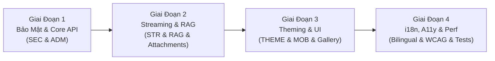

# BÁO CÁO TOÀN DIỆN: AUDIT TÍNH NĂNG VÀ GIAO DIỆN HỆ THỐNG VIKINI

**Ngày thực hiện**: 01/10/2026  
**Đơn vị thực hiện**: Lead Full-Stack Developer & Claude Code CLI (kết hợp Dual-Reviewer & Multi-Agent Audit)  
**Phạm vi kiểm tra**: Toàn bộ kiến trúc ứng dụng, Backend APIs, CSDL Supabase, Giao diện người dùng (UI/UX), Hệ thống Theming, Tính tương thích Di động/Foldable, Chuẩn Song ngữ (Bilingual) và Khả năng Tiếp cận (WCAG 2.2).

---

## MỤC LỤC

1. [Tóm Tắt Điều Hành (Executive Summary)](#1-tóm-tắt-điều-hành-executive-summary)
2. [Ma Trận Phân Loại Mức Độ Nghiêm Trọng (Severity Matrix)](#2-ma-trận-phân-loại-mức-độ-nghiêm-trọng-severity-matrix)
3. [Phần 1: Chat, Streaming, Attachments & Model Routing](#3-phần-1-chat-streaming-attachments--model-routing)
4. [Phần 2: Image Studio, Gallery & Media Processing](#4-phần-2-image-studio-gallery--media-processing)
5. [Phần 3: Projects, Knowledge Base (RAG), GEMs/Personas & Admin Dashboard](#5-phần-3-projects-knowledge-base-rag-gemspersonas--admin-dashboard)
6. [Phần 4: Global UI, Theming, Mobile/Foldable, Bilingual & Accessibility](#6-phần-4-global-ui-theming-mobilefoldable-bilingual--accessibility)
7. [Lộ Trình Khắc Phục Khuyến Nghị (Actionable Remediation Roadmap)](#7-lộ-trình-khắc-phục-khuyến-nghị-actionable-remediation-roadmap)

---

## 1. TÓM TẮT ĐIỀU HÀNH (EXECUTIVE SUMMARY)

Vikini là một nền tảng AI Chat & Media thế hệ mới được xây dựng trên **Next.js 16 (App Router)**, **TypeScript Strict**, **Tailwind CSS 4**, và **Supabase PostgreSQL**. Đợt kiểm tra tự động trước phiên audit ghi nhận hệ thống kiểm thử tự động đạt **82 test files / 892 unit & integration tests pass (100%)**.

Tuy nhiên, thông qua phiên rà soát chuyên sâu từng dòng mã bằng **Claude Code CLI** kết hợp cùng các Agent chuyên trách, chúng tôi đã phát hiện **nhiều lỗ hổng nghiêm trọng ở tầng logic nghiệp vụ, bảo mật ủy quyền (Authorization / Ownership), quản trị hệ thống, và trải nghiệm người dùng thực tế** mà bộ unit tests hiện tại chưa bao phủ tới:

1. **Bảo mật & Ủy quyền (Security & Ownership)**:
   - **IDOR trong xóa tin nhắn/file (`deleteMessage`)**: Bất kỳ người dùng đã đăng nhập nào cũng có thể xóa tin nhắn và file đính kèm/ảnh trong Supabase Storage của người khác.
   - **Rò rỉ tài liệu chéo người dùng qua RAG Context**: Lấy nhầm `project_id` của người khác và nạp tài liệu nội bộ vào prompt của user đối thủ do RPC `match_project_knowledge` chạy chế độ `SECURITY DEFINER` nhưng không kiểm tra quyền sở hữu `user_id`.
   - **Lỗ hổng SSRF**: `/api/describe-image` và `/api/edit-image` cho phép fetch URL tùy ý không giới hạn, đe dọa mạng nội bộ và nguy cơ tấn công từ chối dịch vụ (OOM).
   - **Lỗ hổng Code Injection**: Công cụ `calculate` trong `functionRegistry.ts` dùng `new Function` đánh giá chuỗi biểu thức, có thể đọc đường dẫn máy chủ qua `process.cwd()`.

2. **Lỗi Quản trị & Nghiệp vụ cốt lõi (Admin & Core Logic)**:
   - **Admin không thể cập nhật User (100% thất bại)**: Giao diện gửi `UUID`, nhưng backend bắt buộc `Email` và văng lỗi 400. Đồng thời thống kê tin nhắn của user trong modal luôn trả về 0.
   - **Tê liệt phân trang Gallery & Nguy cơ sập DB**: `/api/gallery` kéo toàn bộ messages của tất cả hội thoại về RAM của Node.js server trước khi cắt `slice`.
   - **File nhị phân (.pdf, .docx) bị đọc sai thành chuỗi rác UTF-8**: `KnowledgePanel.tsx` dùng `file.text()` tải trực tiếp buffer nhị phân lên vector database.
   - **Lệnh đổi theme trong `CommandPalette` phá vỡ giao diện**: Gán `setTheme("dark")`/`setTheme("light")` trong khi hệ thống dùng 16 theme định danh riêng.

3. **Giao diện, Khả năng Tiếp cận & Song ngữ (UI/UX, A11y, i18n)**:
   - Nút đóng modal chi tiết ảnh trong Gallery là thẻ rỗng `<button></button>` (không thể bấm đóng).
   - Thanh trượt so sánh ảnh tê liệt trên màn hình cảm ứng (chỉ bắt sự kiện chuột).
   - Theme `orchid` là Light theme nhưng bị gán `tone: "dark"` và `color-scheme: dark`.
   - Thiếu `interactiveWidget: "resizes-content"` khiến bàn phím ảo che mất thanh chat trên mobile.
   - Hơn 30 chuỗi văn bản tiếng Anh hardcoded trên UI, và phím tắt `Ctrl+K` bị giam trong trang chat.

---

## 2. MA TRẬN PHÂN LOẠI MỨC ĐỘ NGHIÊM TRỌNG (SEVERITY MATRIX)

| Mã ID        | Phân Hệ        |   Mức Độ    | Vị Trí File                                               | Tóm Tắt Tác Động                                                     |
| :----------- | :------------- | :---------: | :-------------------------------------------------------- | :------------------------------------------------------------------- |
| **SEC-01**   | Chat / Storage | `[BLOCKER]` | `src/lib/features/chat/messages.ts:328`                   | IDOR: Xóa message và file Storage của bất kỳ người dùng nào          |
| **SEC-02**   | RAG / Projects | `[BLOCKER]` | `src/lib/features/projects/ragContext.server.ts:31`       | Rò rỉ tài liệu tri thức chéo người dùng qua RPC RAG Context          |
| **SEC-03**   | Media API      | `[BLOCKER]` | `src/app/api/describe-image/route.ts:52`                  | Lỗ hổng SSRF tấn công mạng nội bộ và gây tràn bộ nhớ máy chủ         |
| **SEC-04**   | Function Tools | `[BLOCKER]` | `src/lib/features/chat/functionRegistry.ts:228`           | Thực thi mã không an toàn với `new Function` trong `calculate`       |
| **ADM-01**   | Admin          | `[BLOCKER]` | `src/app/api/admin/users/route.ts:22`                     | Admin 100% không cập nhật được Rank / Block User (UUID vs Email)     |
| **API-01**   | Gallery        | `[BLOCKER]` | `src/app/api/gallery/route.ts:117`                        | Unbounded Fetch tải toàn bộ messages vào RAM gây sập PostgREST       |
| **UI-01**    | UI / Theming   | `[BLOCKER]` | `src/app/features/chat/components/CommandPalette.tsx:83`  | Lệnh switch-theme gán "dark"/"light" phá vỡ hoàn toàn CSS            |
| **UI-02**    | Gallery UI     | `[BLOCKER]` | `src/app/features/gallery/components/GalleryView.tsx:328` | Ghost Button: Nút đóng modal chi tiết ảnh rỗng ruột                  |
| **A11Y-01**  | Image Canvas   | `[BLOCKER]` | `src/app/features/image-gen/components/Canvas.tsx:226`    | Lớp điều khiển biến mất khi duyệt phím Tab (mất focus indicator)     |
| **I18N-01**  | Bilingual      | `[BLOCKER]` | `src/lib/utils/translations/vi.ts:47`                     | Thiếu 3 keys trong `vi.ts`; Type assertion vô hiệu hóa compile check |
| **SEC-05**   | Projects       |  `[MAJOR]`  | `src/lib/features/projects/projects.server.ts:222`        | Gỡ liên kết hội thoại người khác khi xóa project thất bại            |
| **SEC-06**   | Image Gen      |  `[MAJOR]`  | `src/app/api/generate-image/route.ts:59`                  | Bỏ qua kiểm tra rank batchSize và daily quota trước khi tạo ảnh      |
| **RAG-01**   | Projects RAG   |  `[MAJOR]`  | `src/components/features/projects/KnowledgePanel.tsx:67`  | File PDF / DOCX bị đọc dạng text UTF-8 làm hỏng dữ liệu vector       |
| **STR-01**   | Chat Stream    |  `[MAJOR]`  | `src/app/api/chat-stream/streaming/openai-stream.ts:193`  | Gửi ảnh với role: "assistant" trên OpenRouter / Groq                 |
| **STR-02**   | Chat Stream    |  `[MAJOR]`  | `src/app/api/chat-stream/streaming/gemini-stream.ts:171`  | Mất system prompt và persona instructions sau khi gọi tool           |
| **STR-03**   | Chat Stream    |  `[MAJOR]`  | `src/app/features/chat/components/InputForm.tsx:154`      | Enter khi đang streaming làm mất câu trả lời; Enter lỗi gõ Telex IME |
| **ADM-02**   | Admin          |  `[MAJOR]`  | `src/app/api/admin/stats/route.ts:24`                     | Thống kê người dùng trong Modal luôn hiển thị 0                      |
| **ADM-03**   | Admin          |  `[MAJOR]`  | `src/app/admin/components/RankConfigManager.tsx:166`      | Giá trị `NaN` lọt qua validation làm văng lỗi SQL database           |
| **THEME-01** | Theming        |  `[MAJOR]`  | `src/lib/config/theme-config.ts:17`                       | Theme Orchid là Light theme nhưng bị gán tone dark                   |
| **THEME-02** | Theming        |  `[MAJOR]`  | 10 file CSS trong `themes/focus/` & `themes/ra2/`         | Thiếu token `--surface-elevated` làm lệch màu popup/dialog           |
| **MOB-01**   | Mobile UX      |  `[MAJOR]`  | `src/app/layout.tsx:16`                                   | Thiếu `interactiveWidget: "resizes-content"` bàn phím che input      |
| **PERF-01**  | Performance    |  `[MAJOR]`  | `src/app/features/sidebar/components/Sidebar.tsx:211`     | Vỡ React.memo: Callback không bọc useCallback re-render 60fps        |
| **A11Y-02**  | Accessibility  |  `[MAJOR]`  | `src/components/ui/IconPicker.tsx:98`                     | BANNED `
` không bắt phím Enter/Space            |

---

## 3. PHẦN 1: CHAT, STREAMING, ATTACHMENTS & MODEL ROUTING

### 3.1. Các Lỗ Hổng Bảo Mật (Security Vulnerabilities)

- **S1. Lỗ hổng kiểm tra quyền sở hữu hội thoại (`conversationLoader.ts:20–26`)**:
  Hàm nạp hội thoại theo ID mà không đối chiếu với `userId`. Người dùng có thể truyền `conversationId` của người khác để kéo lịch sử đã giải mã vào context mô hình, gửi thêm tin nhắn và kích hoạt xóa tin nhắn.
  _Khắc phục_: Trả về 404 nếu `convo.userId !== userId`.
- **S2. `upsertMessage` không xác thực quyền sở hữu (`api/messages/route.ts:60–70`)**:
  Bất kỳ user nào có phiên đăng nhập đều có thể chèn hoặc ghi đè tin nhắn của cuộc trò chuyện bất kỳ; trường `content` không giới hạn độ dài và `meta` sử dụng `.passthrough()`.
  _Khắc phục_: Kiểm tra quyền sở hữu conversation, áp đặt max length cho `content`, whitelist các khóa trong `meta`.
- **S3. Thực thi mã độc qua `calculate` Tool (`functionRegistry.ts:228–249`)**:
  Đánh giá chuỗi do AI sinh ra bằng `new Function`! Bộ lọc ký tự cho phép `process.cwd()` chạy trót lọt và in ra đường dẫn thư mục nguồn. Chuỗi `9n**99999999n` có thể làm treo CPU máy chủ.
  _Khắc phục_: Thay thế bằng parser biểu thức toán học an toàn (như `mathjs` trong sandbox giới hạn).
- **S4. XSS / Rò rỉ dữ liệu qua Markdown Image Tag (`BubbleMarkdown.tsx:146`, `next.config.ts:74`)**:
  CSP cho phép `img-src https:`. Nội dung độc hại có thể nhúng thẻ `` để đánh cắp dữ liệu trò chuyện mà không cần người dùng nhấp chuột.
  _Khắc phục_: Thắt chặt CSP `img-src` chỉ cho phép domain Supabase storage hoặc loại bỏ thẻ `img` ngoại lai trong sanitize schema.
- **S5. Crash 500 do Cookie Decode lỗi (`chatStreamHelpers.ts:38`)**:
  `decodeURIComponent` ném Exception khi gặp ký tự `%` đơn lẻ. Thao tác này chạy sau khi đã lưu tin nhắn của user, dẫn tới mỗi lần retry lại sinh ra một tin nhắn mồ côi (orphan message).

### 3.2. Lỗi Luồng Server Streaming (`/api/chat-stream`)

- **Gửi ảnh sai vai trò trên OpenRouter / Groq (`openai-stream.ts:193`)**:
  Mã nguồn hardcode `role: "assistant"` cho bất kỳ tin nhắn nào có ảnh, khiến ảnh người dùng tải lên bị hiểu nhầm thành câu trả lời của trợ lý AI.
- **Mất System Prompt & Persona sau khi gọi Gemini Tool (`gemini-stream.ts:171, 419–431`)**:
  Khi cache kích hoạt, `systemInstruction` bị để trống. Lượt gọi tiếp theo sau khi tool thực thi hoàn toàn không truyền `systemInstruction`, khiến toàn bộ tính cách Persona và chỉ dẫn GEM biến mất giữa chừng.
- **Gemini Fallback kích hoạt sai và phát lỗi trùng lặp (`gemini-stream.ts:590–626`)**:
  Mọi lỗi non-429 đều kích hoạt fallback no-tools; token đã stream trước đó bị gửi lại lần 2 và client bị nhận 2 sự kiện `error` liên tiếp.
- **Lưu trữ suy luận `<think>` lẫn vào nội dung tin nhắn (`chatStreamCore.ts`, `ChatBubble.tsx`)**:
  Thẻ `<think>` bị lưu cùng văn bản chính khiến token context bị đội lên ở các lượt sau, nút Copy sao chép luôn cả phần suy luận, và tính năng đọc Text-to-Speech (TTS) đọc to cả đoạn suy nghĩ nội bộ.
  _Khắc phục_: Tách nội dung reasoning thành một SSE event riêng biệt (`thinking`) và lưu trong trường `meta.reasoning`.

### 3.3. Lỗi Hệ Thống Tệp Đính Kèm (Attachments System)

- **Tệp ảnh không hợp lệ làm hỏng vĩnh viễn cuộc trò chuyện (`fileValidation.ts:267, 352`)**:
  Hệ thống chấp nhận `svg`, `bmp`, `ico` là ảnh nhưng các AI provider từ chối MIME này. Do tệp lịch sử được tự động tiêm lại ở mỗi lượt chat, cuộc trò chuyện sẽ bị lỗi vĩnh viễn cho đến khi tệp bị xóa.
- **Xử lý tệp lịch sử trước tệp mới tải lên (`attachmentProcessor.ts:240–267`)**:
  Hạn mức token bị tiêu hao cho các tệp cũ trong quá khứ trước khi đọc tệp ở lượt hiện tại, khiến tệp vừa tải lên bị bỏ qua với lý do "vượt quá context limit".
- **Lỗi hiển thị Upload: `[object Object]` (`useFileUpload.ts:288`)**:
  Client cố gắng stringify `body.error` (vốn là object JSON chuẩn của API), khiến người dùng chỉ nhìn thấy thông báo lỗi xấu xí `[object Object]`.
- **Lỗi Parser bảng tính Excel (`documentParsers.ts:148`)**:
  Độ rộng bảng tính bị cắt theo số cột của dòng đầu tiên. Nếu dòng 1 là tiêu đề gộp ô (1 cột), toàn bộ các cột dữ liệu phía sau bị xóa sạch.

### 3.4. Trải Nghiệm Chat Phía Client (Client Chat UX)

- **Mất câu trả lời khi nhấn Enter trong lúc đang stream (`InputForm.tsx:154–161`)**:
  Nhấn Enter trực tiếp gọi `handleSubmit`, hủy bỏ kết nối hiện tại và xóa sạch bộ đệm văn bản đang hiển thị.
- **Lỗi gõ tiếng Việt Telex / CJK IME (`InputForm.tsx:155`)**:
  Nhấn Enter để chọn từ gõ tiếng Việt có thể vô tình kích hoạt gửi tin nhắn ngay giữa chừng. Cần kiểm tra `e.nativeEvent.isComposing`.
- **Tin nhắn chỉ chứa File bị hủy bỏ im lặng (`InputForm.tsx:186`, `ChatControls.tsx:324`)**:
  Người dùng gửi ảnh hoặc tài liệu không kèm lời nhắn thì tin nhắn bị hủy vì `coreSend` từ chối `text` rỗng.

---

## 4. PHẦN 2: IMAGE STUDIO, GALLERY & MEDIA PROCESSING

### 4.1. Lỗ Hổng Bảo Mật & Xác Thực (Security & Auth)

- **SEC-01. IDOR trong `deleteMessage` (`src/lib/features/chat/messages.ts:328–349`)**:
  Hàm nhận `userId` từ session nhưng **không sử dụng `userId` trong câu lệnh SQL**. Khi xóa tin nhắn tạo ảnh (`meta.type === "image_gen"`), hàm xóa cả file trên bucket `attachments`. Kẻ xấu có thể xóa sạch ảnh và tin nhắn của bất kỳ ai nếu biết ID.
- **SEC-03. SSRF trong Describe Image & Edit Image (`/api/describe-image/route.ts:52`, `/api/edit-image/route.ts:84`)**:
  Server nhận chuỗi URL bất kỳ và gọi `fetch(imageUrl)` mà không kiểm tra IP Loopback hay Private Network. Kẻ tấn công có thể quét cổng mạng nội bộ hoặc gọi `http://169.254.169.254/` để lấy cloud credentials.
- **SEC-06. Bypass Hạn Ngạch Quota Tạo Ảnh (`/api/generate-image/route.ts:59`)**:
  Backend không kiểm tra `maxBatchSize` theo rank và không kiểm tra số lượt còn lại trong ngày trước khi sinh ảnh. Client gửi N request song song cho 1 mẻ ảnh gây trừ quota sai lệch.

### 4.2. Lỗi API & Cơ Sở Dữ Liệu

- **API-01. Unbounded DB Fetch trong Gallery (`/api/gallery/route.ts:117–156`)**:
  Câu truy vấn kéo **toàn bộ** tin nhắn của tất cả cuộc trò chuyện của user về RAM server Node.js rồi mới `allImages.slice(offset, offset + limit)`. Khi user có nhiều ảnh, thao tác này gây nghẽn RAM, nghẽn mạng và lỗi PostgREST URL khi số lượng conversation vượt quá 500.
- **API-02. Ảnh từ Image Studio bị biến mất khỏi Gallery (`/api/gallery/route.ts:106`)**:
  Code loại trừ: `c.model !== MODEL_IDS.IMAGE_STUDIO`. Kết quả: người dùng tạo ảnh trong Image Studio nhưng khi vào Gallery lại hoàn toàn không thấy ảnh đâu.
- **API-03. Rò rỉ bộ nhớ Supabase Storage khi xóa ảnh Edit (`messages.ts:340`)**:
  Chỉ kiểm tra `meta.type === "image_gen"`, bỏ qua `meta.type === "image_edit"`. Toàn bộ file ảnh chỉnh sửa khi xóa đều bị bỏ lại trên storage vĩnh viễn.
- **API-04. Tràn Payload HTTP 413 trên Multi-Turn Edit (`EditPanel.tsx:153`, `edit-image-multi/route.ts:31`)**:
  Client nhồi chuỗi Base64 (2–4MB mỗi ảnh) vào `editHistory` và gửi lặp lại ở mỗi lượt sửa tiếp theo. Sau 2 lượt, payload vượt quá ngưỡng 4.5MB của Next.js Serverless gây lỗi 413.

### 4.3. Lỗi Giao Diện & Trợ Năng (UI/UX & A11y)

- **UI-02. Ghost Button - Nút đóng modal chi tiết ảnh rỗng ruột (`GalleryView.tsx:328`)**:
  `<button onClick={() => g.setSelectedImage(null)}></button>` không có icon, không có chữ, trong khi nút đóng mặc định của Radix Dialog đã bị ẩn bằng CSS `[&>button]:hidden`. Người dùng di động không có cách nào bấm đóng modal.
- **UI-03. Thanh trượt so sánh ảnh tê liệt trên màn hình cảm ứng (`ImageCompareModal.tsx:167`)**:
  Chỉ gắn `onMouseMove`, thiếu hoàn toàn `onTouchMove` và `onTouchStart`.
- **A11Y-01. Lớp điều khiển tàng hình khi duyệt phím Tab (`Canvas.tsx:226`)**:
  Lớp phủ có `group-hover:opacity-100` nhưng thiếu `group-focus-within:opacity-100`. Người dùng bàn phím Tab vào nút Remix/Edit/Download nhưng không hề nhìn thấy nút trên màn hình.
- **Thiếu 100% Co-located Unit Tests**:
  Toàn bộ các file trong `src/lib/features/image-gen/` (`ImageGenFactory.ts`, `GeminiNativeImageProvider.ts`, `OpenAIImageProvider.ts`, `ReplicateImageProvider.ts`) đều chưa có bất kỳ file test nào đi kèm.

---

## 5. PHẦN 3: PROJECTS, KNOWLEDGE BASE (RAG), GEMS/PERSONAS & ADMIN DASHBOARD

### 5.1. Lỗ Hổng Bảo Mật & Rò Rỉ Dữ Liệu

- **SEC-02. Rò rỉ tài liệu tri thức chéo người dùng qua RAG (`ragContext.server.ts:31–42`, `knowledge.server.ts:286`)**:
  `getConversationProjectId` không kiểm tra `user_id`. RPC `match_project_knowledge` chạy `SECURITY DEFINER` mà không đối chiếu quyền sở hữu `userId`. Người dùng B có thể truy xuất các đoạn kiến thức nội bộ bí mật của Người dùng A thông qua truy vấn RAG.
- **SEC-05. Phá hủy liên kết hội thoại người khác khi xóa dự án (`projects.server.ts:222`)**:
  Lệnh `conversations.update({ project_id: null }).eq("project_id", projectId)` chạy trước khi kiểm tra quyền sở hữu `eq("user_id", userId)`. Lệnh xóa thất bại nhưng hội thoại của người khác đã bị hủy liên kết.
- **SEC-07. Nguy cơ Prompt Injection qua thẻ XML System Prompt (`chatStreamCore.ts:344–367`)**:
  Nội dung của GEM Prompt và Persona Prompt được bọc trong `<task_instructions>` và `<style_preferences>` nhưng không escape thẻ đóng. Kẻ tấn công có thể chèn `</task_instructions>\n[SYSTEM OVERRIDE]` để chiếm quyền điều khiển LLM.

### 5.2. Lỗi Cơ Sở Dữ Liệu & RAG Vector

- **RAG-01. Đọc file nhị phân PDF/DOCX thành chuỗi rác UTF-8 (`KnowledgePanel.tsx:67`)**:
  Client gọi `await file.text()` trên file PDF/DOCX nhị phân và gửi chuỗi ký tự rác (`\uFFFD`) lên backend để băm vector. Kết quả: tài liệu nhúng trở thành văn bản vô nghĩa.
- **DB-01. Quét tuần tự toàn bảng (Sequential Scan) trên `knowledge_chunks`**:
  Model `gemini-embedding-2` có 3072 chiều. PostgreSQL HNSW index chỉ hỗ trợ tối đa 2000 chiều nên bảng `knowledge_chunks` hiện **không hề có index vector**. Mọi câu query đều phải quét tuần tự toàn bộ bảng.
- **RAG-02. Lệch ngưỡng tương đồng (Threshold Mismatch)**:
  API tìm kiếm thủ công đặt ngưỡng `0.7` (quá cao đối với không gian 3072 chiều, luôn trả về 0 kết quả), trong khi luồng RAG stream lại đặt `0.5`.
- **RAG-03. Trích dẫn RAG bị thất lạc hoàn toàn (`chatStreamCore.ts:374–386`)**:
  `buildRAGContext` trả về mảng `sources` chứa tên file và độ tương đồng nhưng luồng chat stream không hề gửi qua SSE meta event và không lưu vào tin nhắn.

### 5.3. Lỗi Quản Trị Hệ Thống (Admin Dashboard)

- **ADM-01. LỖI BLOCKER: 100% thao tác sửa User đều thất bại (`UserManager.tsx:132`, `api/admin/users/route.ts:22–26`)**:
  Giao diện gửi `user.id` là UUID, nhưng backend kiểm tra `EMAIL_REGEX` và lập tức ném lỗi 400 `Invalid userId format`. Không thể đổi Rank hoặc Khóa người dùng từ Admin UI!
- **ADM-02. Thống kê hội thoại của người dùng luôn bằng 0 (`api/admin/stats/route.ts:24–33`)**:
  Backend đếm hội thoại bằng `.eq("user_id", userId)` (với UUID truyền vào), nhưng bảng `conversations.user_id` trong Vikini lại lưu Email của người dùng.
- **ADM-03. Giá trị `NaN` làm sập truy vấn SQL (`RankConfigManager.tsx:166`, `rank-configs/route.ts:77`)**:
  Admin xóa ô nhập số sinh ra `NaN`. Trong JS `typeof NaN === "number"` là true nên lọt qua validation và làm sập câu lệnh SQL với lỗi `invalid input syntax for type integer: "NaN"`.
- **Thiếu đồng bộ ghi Audit Log Admin**:
  Các thao tác chỉnh sửa GEMs và Personas của Admin chỉ ghi ra console terminal (`logger.audit`), không ghi vào CSDL `admin_audit_logs`.

---

## 6. PHẦN 4: GLOBAL UI, THEMING, MOBILE/FOLDABLE, BILINGUAL & ACCESSIBILITY

### 6.1. Lỗi Theming & Glassmorphism

- **UI-01. Lệnh "switch-theme" phá vỡ giao diện hệ thống (`CommandPalette.tsx:83–91`)**:
  Thực thi `setTheme("dark")` hoặc `setTheme("light")`. Vikini có 16 theme riêng biệt, không có theme nào tên là "dark" hay "light". Giao diện bị mất hoàn toàn biến CSS màu sắc khi kích hoạt lệnh này.
- **THEME-01. Theme Orchid Silk bị cấu hình sai Tone (`theme-config.ts:17`, `base.css:135`)**:
  Orchid là Light theme nhưng bị gán `tone: "dark"` và `color-scheme: dark`, ép trình duyệt hiển thị thanh cuộn và input tối trên nền tím sáng.
- **THEME-02. Thiếu Token `--surface-elevated` trong 10/16 Theme CSS**:
  Các theme như `blueprint` (mặc định), `amber`, `gold`, `charcoal`, `ra2/allied`... thiếu token này, khiến Dialog và Popover bị rơi về màu xám lạnh mặc định `#0f1115`.
- **Sử dụng Raw Color Class `text-white` (`error-boundary.tsx:76`)**:
  Nút reload dùng chữ trắng trên nền `--accent`. Trong theme Gold hoặc Holo Cyan, tỷ lệ tương phản chỉ đạt 1.4:1 (không thể đọc được).

### 6.2. Trải Nghiệm Di Động & Thiết Bị Gập (Mobile & Foldables)

- **MOB-01. Thiếu `interactiveWidget: "resizes-content"` (`layout.tsx:16–20`)**:
  Khi mở bàn phím ảo trên điện thoại, thanh `ChatControls` bị bàn phím che khuất hoàn toàn ô nhập liệu.
- **MOB-02. Thiếu Safe-Area Padding (`--sal`, `--sar`) khi xoay ngang máy**:
  HeaderBar và ChatControls thiếu khoảng đệm an toàn bên hông, khiến nút Menu và Action bị camera nốt ruồi hoặc rãnh gập che khuất.
- **MOB-03. Sidebar di động thiếu cử chỉ vuốt chạm đóng (Touch Swipe)**:
  Drawer không hỗ trợ kéo vuốt sang trái để đóng.
- **MOB-04. Độ rộng cứng `w-72` trong `popover.tsx` làm tràn viền màn hình ngoài của Galaxy Z Fold** (màn hình hẹp ~280px).

### 6.3. Chuẩn Song Ngữ (Bilingual i18n - Rule 04)

- **I18N-01. Thiếu 3 translation keys trong `vi.ts` so với `en.ts`**:
  `language`, `themes`, `loadingConfigs`. Biểu thức Type Assertion trong `translations/index.ts` bị ép kiểu lỏng lẻo khiến `npm run type-check` không thể phát hiện lỗi.
- **I18N-02. Vi phạm Rule 04: Prop Drilling `t` trong `Sidebar.tsx:77`**:
  Truyền `t` dạng `Record<string, string>` từ cha xuống con thay vì gọi hook `useLanguage()`.
- **Hơn 25 chuỗi văn bản tiếng Anh hardcoded**:
  Tại `HeaderBar.tsx`, `Sidebar.tsx`, `SidebarItem.tsx`, `KnowledgePanel.tsx`, `PersonaEditor.tsx`, `UserManager.tsx`...

### 6.4. Khả Năng Tiếp Cận (Accessibility - WCAG 2.2) & Hiệu Năng

- **A11Y-02. Anti-Pattern: `
` trong `IconPicker.tsx:98`**:
  Không bắt sự kiện bàn phím Enter/Space, bên trong lại chứa nút con `<button>`, vi phạm tiêu chuẩn interactive control lồng nhau.
- **A11Y-03. Thiếu Visible Focus Indicators trên toàn bộ Sidebar & Interactive Elements**:
  Các nút chọn hội thoại, menu 3 chấm, nút đóng thông báo toast đều thiếu `focus-visible:ring-2`.
- **PERF-01. Vỡ Memoization tại `Sidebar.tsx` gây Lag 60fps khi AI Streaming**:
  Các hàm callback `handleSelect`, `handleRename`, `handleDelete` không dùng `useCallback`, khiến hàng trăm `SidebarItem` bị re-render liên tục theo từng token AI stream về.
- **PERF-02. Vi phạm quy tắc Anti-Pattern: Tự chế SVG thủ công trong `SidebarItem.tsx`**:
  Khai báo 4 hàm component SVG thay vì dùng `lucide-react`.

---

## 7. LỘ TRÌNH KHẮC PHỤC KHUYẾN NGHỊ (ACTIONABLE REMEDIATION ROADMAP)

Để đưa Vikini đạt chuẩn chất lượng sản phẩm thương mại cao cấp, chúng tôi đề xuất phân chia công tác khắc phục thành **4 giai đoạn tuần tự**, tuân thủ nghiêm ngặt Giao thức Plan-Review (`05-plan-review.md`):

### Giai Đoạn 1: Vá Khẩn Cấp Các Lỗ Hổng Bảo Mật & Sửa Lỗi Admin Dashboard (P0 - Blocker)

1. **Khắc phục SEC-01 & SEC-02**:
   - Bổ sung xác thực quyền sở hữu `userId` trong `messages.ts:deleteMessage` trước khi thực hiện xóa message và file storage.
   - Bổ sung kiểm tra `user_id` trong `ragContext.server.ts:getConversationProjectId` và truyền `userId` vào RPC RAG.
2. **Khắc phục SEC-03 & SEC-04**:
   - Chặn dải IP private/loopback, thêm whitelist domain và timeout/size cap cho `/api/describe-image` và `/api/edit-image`.
   - Thay thế `new Function` trong `functionRegistry.ts:calculate` bằng parser toán học an toàn.
3. **Khắc phục ADM-01 & ADM-02**:
   - Sửa hàm `isValidUserId` trong `api/admin/users/route.ts` hỗ trợ cả UUID và Email; sửa truy vấn update profile theo đúng cột.
   - Sửa `api/admin/stats/route.ts` phân giải UUID sang Email trước khi đếm conversations.
4. **Khắc phục API-01 & UI-01**:
   - Thêm phân trang và điều kiện lọc trực tiếp ở tầng database cho `/api/gallery/route.ts`.
   - Thay thế logic `setTheme("dark")` trong `CommandPalette.tsx` bằng `toggleTheme()` hợp lệ.

### Giai Đoạn 2: Chuẩn Hóa Streaming, Attachments & Xử Lý Tệp RAG (P1 - High)

1. **Khắc phục STR-01 & STR-02**:
   - Sửa `role: "user"` khi gửi ảnh trong `openai-stream.ts:193`.
   - Giữ nguyên `systemInstruction` và persona trong các lượt tool continuation của Gemini.
2. **Tách Biệt Luồng Reasoning `<think>`**:
   - Chuyển thẻ suy luận thành SSE event riêng (`thinking`) và lưu trữ vào trường `meta.reasoning` thay vì trộn vào content.
3. **Chuẩn Hóa Attachments & Trích Xuất RAG (RAG-01)**:
   - Tích hợp module trích xuất văn bản server-side cho PDF/DOCX thay vì gọi `file.text()` ở frontend.
   - Đảo thứ tự ưu tiên: xử lý tệp của lượt hiện tại trước tệp lịch sử; đồng bộ ngưỡng RAG về `0.5`.
   - Sửa lỗi tràn kích thước Body HTTP 413 trên Multi-Turn Image Edit bằng cách truyền `storagePath`.

### Giai Đoạn 3: Tối Ưu Hóa Theming, Mobile/Foldable & Gallery UX (P2 - Medium)

1. **Khắc phục THEME-01 & THEME-02**:
   - Đổi `tone: "light"` cho Orchid; bổ sung `--surface-elevated` trong 10 theme CSS đang thiếu.
   - Bổ sung `--accent-foreground` trong tất cả theme để đảm bảo độ tương phản WCAG AA.
2. **Nâng Cấp Trải Nghiệm Mobile & Foldable**:
   - Thêm `interactiveWidget: "resizes-content"` vào `layout.tsx:viewport`.
   - Bổ sung safe-area padding `--sal`, `--sar` cho HeaderBar và ChatControls khi xoay ngang máy.
   - Thay `w-72` trong popover bằng `w-[min(18rem,calc(100vw-2rem))]`.
3. **Sửa Lỗi Giao Diện Gallery & Image Studio**:
   - Sửa Ghost Button trong `GalleryView.tsx`: thêm icon `<X />` và `aria-label`.
   - Thêm sự kiện vuốt chạm `onTouchMove` cho thanh trượt so sánh ảnh.
   - Cho phép hiển thị ảnh từ Image Studio trong Gallery.

### Giai Đoạn 4: Hoàn Thiện Song Ngữ, Tiếp Cận WCAG 2.2 & Co-located Tests (P3 - Polish)

1. **Chuẩn Hóa Song Ngữ (Rule 04)**:
   - Bổ sung 3 keys còn thiếu vào `vi.ts`; sửa Type Assertion trong `translations/index.ts`.
   - Xóa bỏ prop drilling `t` trong `Sidebar.tsx`; thay thế hơn 25 chuỗi tiếng Anh hardcoded bằng hàm `t("key")`.
2. **Trợ Năng Accessibility (WCAG 2.2)**:
   - Sửa `IconPicker.tsx`: thay `
` bằng native `<button type="button">`.
   - Bổ sung `focus-visible:ring-2 focus-visible:ring-(--ring)` trên toàn bộ interactive elements.
   - Bổ sung `group-focus-within:opacity-100` cho Canvas overlay.
3. **Tối Ưu Hiệu Năng & Bổ Sung Tests**:
   - Bọc các hàm callback trong `Sidebar.tsx` bằng `useCallback` để bảo vệ `React.memo`.
   - Thay thế các SVG tự chế trong `SidebarItem.tsx` bằng icon từ `lucide-react`.
   - Viết bổ sung đầy đủ co-located tests (`*.test.ts`) cho `src/lib/features/image-gen/`.

---

**Kết luận**: Vikini có nền tảng kiến trúc hiện đại và tiềm năng rất lớn. Việc thực hiện khắc phục theo đúng 4 giai đoạn trên sẽ loại bỏ hoàn toàn các rủi ro bảo mật tiềm ẩn, bảo vệ toàn vẹn dữ liệu người dùng, phục hồi chức năng quản trị và mang lại trải nghiệm mượt mà, chuyên nghiệp trên mọi thiết bị.
