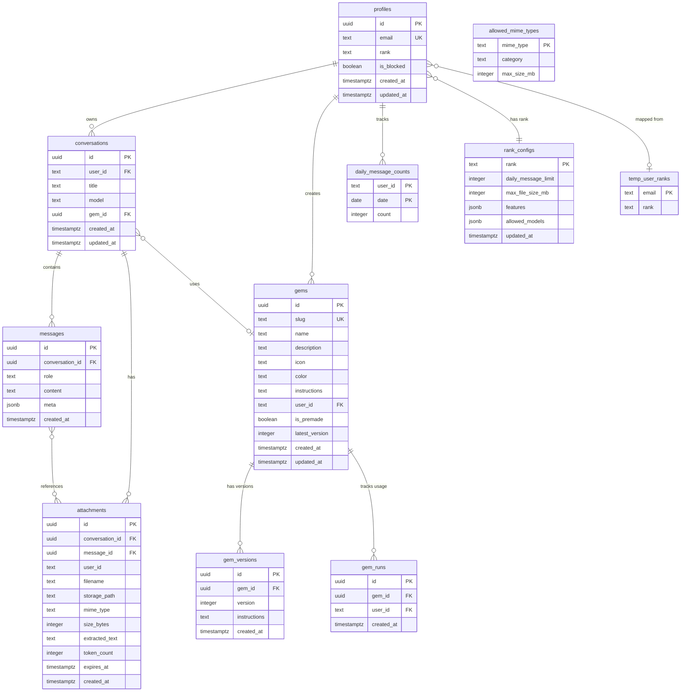

# Database Schema - Vikini

> **Cập nhật**: 2025-12-31  
> **Database**: Supabase PostgreSQL

---

## 1. Entity Relationship Diagram (ERD)



---

## 2. Chi Tiết Các Bảng

### 2.1 `profiles` - Hồ sơ người dùng

| Cột          | Kiểu          | Ràng buộc       | Mô tả                                                |
| ------------ | ------------- | --------------- | ---------------------------------------------------- |
| `id`         | `UUID`        | PRIMARY KEY     | ID từ Supabase Auth                                  |
| `email`      | `TEXT`        | UNIQUE NOT NULL | Email đăng nhập                                      |
| `rank`       | `TEXT`        | NOT NULL, CHECK | Xếp hạng: `basic`, `pro`, `admin`, `not_whitelisted` |
| `is_blocked` | `BOOLEAN`     | DEFAULT false   | Trạng thái khóa tài khoản                            |
| `created_at` | `TIMESTAMPTZ` | DEFAULT now()   | Thời gian tạo                                        |
| `updated_at` | `TIMESTAMPTZ` | DEFAULT now()   | Thời gian cập nhật (auto trigger)                    |

**Index**: `idx_profiles_email`, `idx_profiles_rank`, `idx_profiles_is_blocked`

---

### 2.2 `rank_configs` - Cấu hình xếp hạng

| Cột                   | Kiểu          | Ràng buộc     | Mô tả                                         |
| --------------------- | ------------- | ------------- | --------------------------------------------- |
| `rank`                | `TEXT`        | PRIMARY KEY   | Tên rank: `basic`, `pro`, `admin`             |
| `daily_message_limit` | `INTEGER`     | NOT NULL      | Giới hạn tin nhắn/ngày                        |
| `max_file_size_mb`    | `INTEGER`     | NOT NULL      | Giới hạn file upload (MB)                     |
| `features`            | `JSONB`       | DEFAULT '{}'  | Feature flags: `web_search`, `unlimited_gems` |
| `allowed_models`      | `JSONB`       | DEFAULT '[]'  | Danh sách model AI được phép sử dụng          |
| `updated_at`          | `TIMESTAMPTZ` | DEFAULT now() | Thời gian cập nhật                            |

**Dữ liệu mặc định**:
| Rank | Messages/Day | Max File | Features |
|------|-------------|----------|----------|
| basic | 20 | 5MB | `web_search: false` |
| pro | 100 | 50MB | `web_search: true` |
| admin | 9999 | 100MB | `web_search: true, unlimited_gems: true` |

---

### 2.3 `conversations` - Cuộc hội thoại

| Cột          | Kiểu          | Ràng buộc          | Mô tả                        |
| ------------ | ------------- | ------------------ | ---------------------------- |
| `id`         | `UUID`        | PRIMARY KEY        | ID cuộc hội thoại            |
| `user_id`    | `TEXT`        | NOT NULL           | Email người dùng (lowercase) |
| `title`      | `TEXT`        | DEFAULT 'New Chat' | Tiêu đề (auto-generated)     |
| `model`      | `TEXT`        |                    | Model AI đang sử dụng        |
| `gem_id`     | `UUID`        | FK → gems(id)      | GEM được áp dụng (nullable)  |
| `created_at` | `TIMESTAMPTZ` | DEFAULT now()      | Thời gian tạo                |
| `updated_at` | `TIMESTAMPTZ` | DEFAULT now()      | Thời gian cập nhật           |

**Index**: `idx_conversations_user_id`, `idx_conversations_updated_at`

---

### 2.4 `messages` - Tin nhắn

| Cột               | Kiểu          | Ràng buộc              | Mô tả                                  |
| ----------------- | ------------- | ---------------------- | -------------------------------------- |
| `id`              | `UUID`        | PRIMARY KEY            | ID tin nhắn                            |
| `conversation_id` | `UUID`        | FK → conversations(id) | Cuộc hội thoại chứa tin nhắn           |
| `role`            | `TEXT`        | NOT NULL               | `user` hoặc `assistant`                |
| `content`         | `TEXT`        |                        | Nội dung (**đã mã hóa AES**)           |
| `meta`            | `JSONB`       |                        | Dữ liệu bổ sung (sources, attachments) |
| `created_at`      | `TIMESTAMPTZ` | DEFAULT now()          | Thời gian tạo                          |

> [!IMPORTANT]
> **Mã hóa**: Cột `content` được mã hóa bằng `encryptText()` trước khi lưu và giải mã bằng `decryptText()` khi đọc. Xem `/lib/core/encryption.ts`.

---

### 2.5 `gems` - AI Personas

| Cột              | Kiểu          | Ràng buộc     | Mô tả                             |
| ---------------- | ------------- | ------------- | --------------------------------- |
| `id`             | `UUID`        | PRIMARY KEY   | ID của GEM                        |
| `slug`           | `TEXT`        | UNIQUE        | URL-friendly identifier           |
| `name`           | `TEXT`        | NOT NULL      | Tên hiển thị                      |
| `description`    | `TEXT`        |               | Mô tả ngắn                        |
| `icon`           | `TEXT`        |               | Emoji hoặc icon name              |
| `color`          | `TEXT`        |               | Mã màu hex                        |
| `instructions`   | `TEXT`        |               | System prompt (latest)            |
| `user_id`        | `TEXT`        |               | Email chủ sở hữu (NULL = premade) |
| `is_premade`     | `BOOLEAN`     | DEFAULT false | GEM hệ thống (read-only)          |
| `latest_version` | `INTEGER`     | DEFAULT 1     | Phiên bản mới nhất                |
| `created_at`     | `TIMESTAMPTZ` | DEFAULT now() | Thời gian tạo                     |
| `updated_at`     | `TIMESTAMPTZ` | DEFAULT now() | Thời gian cập nhật                |

---

### 2.6 `gem_versions` - Lịch sử phiên bản GEM

| Cột            | Kiểu          | Ràng buộc     | Mô tả                       |
| -------------- | ------------- | ------------- | --------------------------- |
| `id`           | `UUID`        | PRIMARY KEY   | ID phiên bản                |
| `gem_id`       | `UUID`        | FK → gems(id) | GEM gốc                     |
| `version`      | `INTEGER`     | NOT NULL      | Số phiên bản                |
| `instructions` | `TEXT`        |               | System prompt của phiên bản |
| `created_at`   | `TIMESTAMPTZ` | DEFAULT now() | Thời gian tạo               |

**Unique**: `(gem_id, version)`

---

### 2.7 `attachments` - Tệp đính kèm

| Cột               | Kiểu          | Ràng buộc              | Mô tả                              |
| ----------------- | ------------- | ---------------------- | ---------------------------------- |
| `id`              | `UUID`        | PRIMARY KEY            | ID attachment                      |
| `conversation_id` | `UUID`        | FK → conversations(id) | Cuộc hội thoại                     |
| `message_id`      | `UUID`        | FK → messages(id)      | Tin nhắn (nullable)                |
| `user_id`         | `TEXT`        | NOT NULL               | Email người upload                 |
| `filename`        | `TEXT`        | NOT NULL               | Tên file gốc                       |
| `storage_path`    | `TEXT`        | NOT NULL               | Path trong Supabase Storage        |
| `mime_type`       | `TEXT`        |                        | Loại file (image/png, etc.)        |
| `size_bytes`      | `INTEGER`     |                        | Kích thước file                    |
| `extracted_text`  | `TEXT`        |                        | Nội dung trích xuất (cho PDF/text) |
| `token_count`     | `INTEGER`     |                        | Số token ước tính                  |
| `expires_at`      | `TIMESTAMPTZ` |                        | Thời gian hết hạn (36h mặc định)   |
| `created_at`      | `TIMESTAMPTZ` | DEFAULT now()          | Thời gian tạo                      |

**Storage Path Format**: `{userId}/{conversationId}/{uuid}-{filename}`

---

### 2.8 `daily_message_counts` - Đếm tin nhắn hàng ngày

| Cột       | Kiểu      | Ràng buộc      | Mô tả              |
| --------- | --------- | -------------- | ------------------ |
| `user_id` | `TEXT`    | PK (composite) | Email người dùng   |
| `date`    | `DATE`    | PK (composite) | Ngày (YYYY-MM-DD)  |
| `count`   | `INTEGER` | DEFAULT 0      | Số tin nhắn đã gửi |

---

### 2.9 `allowed_mime_types` (DEPRECATED)

> [!WARNING]
> **Deprecated**: Bảng này không còn được sử dụng. Hệ thống đã chuyển sang **blacklist approach**.
>
> Validation được thực hiện trong code (`lib/features/attachments/attachments.ts`) thông qua:
>
> - `BLOCKED_EXTENSIONS` - Extensions bị chặn (exe, bat, ps1, dll, etc.)
> - `BLOCKED_MIME_TYPES` - MIME types nguy hiểm

| Cột           | Kiểu      | Ràng buộc   | Mô tả                                |
| ------------- | --------- | ----------- | ------------------------------------ |
| `mime_type`   | `TEXT`    | PRIMARY KEY | MIME type (image/png, etc.)          |
| `category`    | `TEXT`    |             | Nhóm: image, text, document, archive |
| `max_size_mb` | `INTEGER` |             | Kích thước tối đa (MB)               |

---

## 3. Row Level Security (RLS)

| Bảng                 | RLS Enabled | Policies | Ghi chú                     |
| -------------------- | ----------- | -------- | --------------------------- |
| `profiles`           | ✅          | ❌       | Chỉ service_role truy cập   |
| `conversations`      | ✅          | ❌       | Chỉ service_role truy cập   |
| `messages`           | ✅          | ❌       | Chỉ service_role truy cập   |
| `gems`               | ✅          | ❌       | Chỉ service_role truy cập   |
| `gem_versions`       | ✅          | ❌       | Chỉ service_role truy cập   |
| `attachments`        | ✅          | ❌       | Chỉ service_role truy cập   |
| `allowed_mime_types` | ✅          | ✅       | Read-only cho authenticated |
| `rank_configs`       | ✅          | ✅       | Read-only cho authenticated |

> [!WARNING]
> Nếu thêm client-side Supabase queries trong tương lai, **PHẢI** tạo RLS policies!

---

## 4. Indexes

```sql
-- Profiles
CREATE INDEX idx_profiles_email ON profiles(email);
CREATE INDEX idx_profiles_rank ON profiles(rank);
CREATE INDEX idx_profiles_is_blocked ON profiles(is_blocked) WHERE is_blocked = true;

-- Conversations
CREATE INDEX idx_conversations_user_id ON conversations(user_id);
CREATE INDEX idx_conversations_updated_at ON conversations(updated_at DESC);

-- Messages
CREATE INDEX idx_messages_conversation_id ON messages(conversation_id);
CREATE INDEX idx_messages_created_at ON messages(created_at);

-- Attachments
CREATE INDEX idx_attachments_conversation_id ON attachments(conversation_id);
CREATE INDEX idx_attachments_expires_at ON attachments(expires_at);

-- Daily counts
CREATE INDEX idx_daily_message_counts_user_date ON daily_message_counts(user_id, date);
```

---

## 5. Triggers

### Auto-update `updated_at`

```sql
CREATE OR REPLACE FUNCTION update_updated_at_column()
RETURNS TRIGGER AS $$
BEGIN
  NEW.updated_at = now();
  RETURN NEW;
END;
$$ LANGUAGE plpgsql;

-- Applied to: profiles, rank_configs, conversations, gems
```
