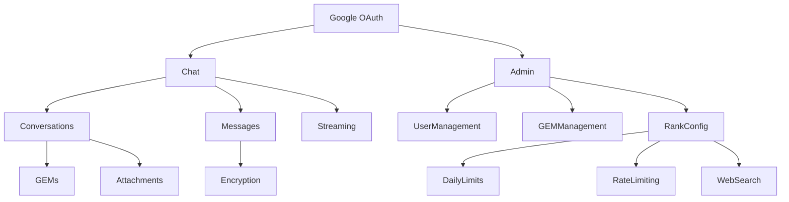

# Features - Vikini

> **Cập nhật**: 2026-01-13

---

## 1. Danh Sách Tính Năng

| Tính năng                | Trạng thái    | Mô tả                                      |
| ------------------------ | ------------- | ------------------------------------------ |
| **Chat Streaming**       | ✅ Hoàn thành | SSE streaming với Gemini AI                |
| **Conversations**        | ✅ Hoàn thành | CRUD + auto-title                          |
| **GEMs System**          | ✅ Hoàn thành | Custom AI personas với versioning          |
| **File Attachments**     | ✅ Hoàn thành | Upload, parse, 36h TTL                     |
| **Image Studio**         | ✅ Hoàn thành | AI Image Generation (Gemini, DALL-E, Flux) |
| **Gallery**              | ✅ Hoàn thành | Image management với infinite scroll       |
| **Message Encryption**   | ✅ Hoàn thành | AES-256-GCM                                |
| **Rate Limiting**        | ✅ Hoàn thành | Redis-based per user                       |
| **Daily Message Limits** | ✅ Hoàn thành | Theo rank                                  |
| **Web Search**           | ✅ Hoàn thành | Optional, rank-gated                       |
| **Admin Dashboard**      | ✅ Hoàn thành | User/GEM/Rank management                   |
| **Google OAuth**         | ✅ Hoàn thành | NextAuth v5                                |

---

## 2. Chi Tiết Tính Năng

### 2.1 Chat System

**Luồng xử lý**:

```
User Input → Rate Limit Check → Daily Limit Check → Build Context → Gemini API → Stream Response → Save to DB
```

**Files liên quan**:

- `/app/api/chat-stream/route.ts` - Entry point
- `/app/api/chat-stream/chatStreamCore.ts` - Core logic
- `/lib/features/chat/conversations.ts` - Conversation CRUD
- `/lib/features/chat/messages.ts` - Message CRUD
- `/lib/core/genaiClient.ts` - Gemini client

---

### 2.2 GEMs (AI Personas)

**Mô tả**: Custom system instructions có thể gắn vào conversation.

**Loại GEM**:

- **Premade**: GEM hệ thống (read-only), quản lý qua Admin
- **Custom**: User tự tạo

**Versioning**: Mỗi lần đổi `instructions` → tạo bản ghi mới trong `gem_versions`.

**Files**:

- `/app/api/gems/route.ts` - API
- `/lib/features/gems/gems.ts` - Business logic

---

### 2.3 Attachments

**Quy trình**:

1. Validate MIME type và size
2. Upload lên Supabase Storage
3. Parse/extract text (PDF, text files)
4. Đếm tokens
5. Đưa vào context khi chat

**TTL**: 36 giờ (cleanup via cron)

**Files**:

- `/app/api/attachments/upload/route.ts`
- `/lib/features/attachments/attachments.ts`

---

### 2.4 Admin Dashboard

**Capabilities**:

- Quản lý users (rank, block)
- Quản lý premade GEMs
- Cấu hình rank limits

**Route**: `/admin`

---

### 2.5 Image Studio

**Mô tả**: Công cụ tạo ảnh AI với nhiều model và style.

**Models hỗ trợ**:

- **Gemini Imagen 3**: Default, miễn phí
- **DALL-E 3**: Yêu cầu OpenAI API key (BYOK)
- **Flux Pro**: Yêu cầu Replicate API key (BYOK)

**Tính năng**:

- Style presets (Anime, Photorealistic, Watercolor, etc.)
- Aspect ratio controls (1:1, 16:9, 9:16, etc.)
- Prompt enhancement (AI cải thiện prompt)
- Download và remix

**Files**:

- `/app/features/image-gen/` - UI Components
- `/app/api/generate-image/route.ts` - API

**Route**: `/image-studio`

---

### 2.6 Gallery

**Mô tả**: Quản lý tất cả ảnh đã tạo trong chat.

**Tính năng**:

- Infinite scroll (20 ảnh/lần)
- Search by prompt
- Filter by date/model
- Remix to chat
- Delete với confirmation

**Files**:

- `/app/features/gallery/` - UI Components
- `/app/api/gallery/route.ts` - API

**Route**: `/gallery`

---

## 3. Roadmap (Dự kiến)

| Tính năng            | Priority | Effort    | Notes                       |
| -------------------- | -------- | --------- | --------------------------- |
| Multi-model support  | High     | Medium    | Thêm Claude, GPT            |
| Code Artifacts       | High     | High      | Render HTML/React real-time |
| Knowledge Base       | Medium   | High      | Persistent document context |
| Voice Chat (TTS/STT) | Medium   | Medium    | Web Speech API              |
| Plugin System        | Low      | Very High | Extensibility               |

---

## 4. Dependencies Giữa Các Tính Năng


