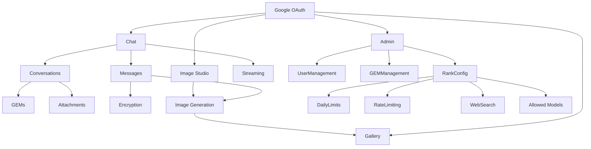

# Features - Vikini

> **Cập nhật**: 2026-01-30

---

## 1. Danh Sách Tính Năng

| Tính năng                 | Trạng thái    | Mô tả                                      |
| ------------------------- | ------------- | ------------------------------------------ |
| **Chat Streaming**        | ✅ Hoàn thành | SSE streaming với Gemini AI                |
| **Enhanced Streaming UX** | ✅ Hoàn thành | Typewriter, auto-scroll, animations        |
| **Conversations**         | ✅ Hoàn thành | CRUD + auto-title + URL sync               |
| **GEMs System**           | ✅ Hoàn thành | Custom AI personas với versioning          |
| **File Attachments**      | ✅ Hoàn thành | Upload, parse, 36h TTL                     |
| **Image Studio**          | ✅ Hoàn thành | AI Image Generation (Gemini, DALL-E, Flux) |
| **Gallery**               | ✅ Hoàn thành | Image management với infinite scroll       |
| **Image Lightbox**        | ✅ Hoàn thành | Fullscreen view + zoom controls            |
| **Image Compare**         | ✅ Hoàn thành | Side-by-side & overlay comparison          |
| **Token Count Display**   | ✅ Hoàn thành | Hiển thị token usage per message           |
| **Message Encryption**    | ✅ Hoàn thành | AES-256-GCM                                |
| **Rate Limiting**         | ✅ Hoàn thành | Redis-based per user                       |
| **Daily Message Limits**  | ✅ Hoàn thành | Theo rank                                  |
| **Web Search**            | ✅ Hoàn thành | Optional, rank-gated                       |
| **Admin Dashboard**       | ✅ Hoàn thành | User/GEM/Rank management                   |
| **Google OAuth**          | ✅ Hoàn thành | NextAuth v5                                |
| **Voice Input (STT)**     | ✅ Hoàn thành | Web Speech API + waveform                  |
| **TTS Playback**          | ✅ Hoàn thành | Read AI responses aloud                    |

---

## 2. Chi Tiết Tính Năng

### 2.1 Chat System

**Luồng xử lý**:

```
User Input → Rate Limit Check → Daily Limit Check → Build Context → Gemini API → Stream Response → Save to DB
```

**Files liên quan**:

- `/app/api/chat-stream/route.ts` - Entry point
- `/app/api/chat-stream/chatStreamCore.ts` - Core logic
- `/lib/features/chat/conversations.ts` - Conversation CRUD
- `/lib/features/chat/messages.ts` - Message CRUD
- `/lib/core/genaiClient.ts` - Gemini client

---

### 2.2 GEMs (AI Personas)

**Mô tả**: Custom system instructions có thể gắn vào conversation.

**Loại GEM**:

- **Premade**: GEM hệ thống (read-only), quản lý qua Admin
- **Custom**: User tự tạo

**Versioning**: Mỗi lần đổi `instructions` → tạo bản ghi mới trong `gem_versions`.

**Files**:

- `/app/api/gems/route.ts` - API
- `/lib/features/gems/gems.ts` - Business logic

---

### 2.3 Attachments

**Quy trình**:

1. Validate MIME type và size
2. Upload lên Supabase Storage
3. Parse/extract text (PDF, text files)
4. Đếm tokens
5. Đưa vào context khi chat

**TTL**: 36 giờ (cleanup via cron)

**Files**:

- `/app/api/attachments/upload/route.ts`
- `/lib/features/attachments/attachments.ts`

---

### 2.4 Admin Dashboard

**Capabilities**:

- Quản lý users (rank, block)
- Quản lý premade GEMs
- Cấu hình rank limits

**Route**: `/admin`

---

### 2.5 Image Studio

**Mô tả**: Công cụ tạo ảnh AI với nhiều model và style.

**Models hỗ trợ**:

- **Gemini Imagen 3**: Default, miễn phí
- **DALL-E 3**: Yêu cầu OpenAI API key (BYOK)
- **Flux Pro**: Yêu cầu Replicate API key (BYOK)

**Tính năng**:

- Style presets (Anime, Photorealistic, Watercolor, etc.)
- Aspect ratio controls (1:1, 16:9, 9:16, etc.)
- Prompt enhancement (AI cải thiện prompt)
- Download và remix

**Files**:

- `/app/features/image-gen/` - UI Components
- `/app/api/generate-image/route.ts` - API

**Route**: `/image-studio`

---

### 2.6 Gallery

**Mô tả**: Quản lý tất cả ảnh đã tạo trong chat.

**Tính năng**:

- Infinite scroll (20 ảnh/lần)
- Search by prompt
- Filter by date/model
- Remix to chat
- Delete với confirmation
- **Image Lightbox**: Fullscreen view với zoom controls
- **Image Compare**: So sánh 2 ảnh (side-by-side hoặc overlay slider)
- Navigation arrows (prev/next) với keyboard support

**Files**:

- `/app/features/gallery/` - UI Components
- `/app/features/gallery/components/ImageCompareModal.tsx` - Compare modal
- `/app/api/gallery/route.ts` - API

**Route**: `/gallery`

---

### 2.7 Voice Features

**Mô tả**: Speech-to-Text input và Text-to-Speech playback.

**Tính năng**:

- Voice input với waveform indicator
- TTS button trên tất cả AI messages
- Auto language detection (VN/EN/DE)
- Browser compatibility warnings

**Files**:

- `/app/features/chat/components/VoiceButton.tsx` - Voice input
- `/app/features/chat/hooks/useTTS.ts` - TTS hook

---

### 2.8 Token Count Display

**Mô tả**: Hiển thị token usage từ Gemini API cho mỗi AI message.

**Tính năng**:

- Badge hiển thị total tokens ở góc dưới-phải của message
- Tooltip breakdown: Input / Output / Thinking tokens
- Format số lớn (1.2K, 1.5M)
- Lưu vào DB trong `messages.meta`

**Data Flow**:

```
Gemini API Response → usageMetadata → SSE event → Save to DB → Load với messages → TokenBadge UI
```

**Token Types**:

- **Input**: Prompt + system instructions + conversation history
- **Output**: Tokens AI đã generate
- **Thinking**: Internal reasoning (Gemini 3 với thinking enabled)

**Files**:

- `/app/api/chat-stream/streaming.ts` - Extract usageMetadata
- `/app/features/chat/components/TokenBadge.tsx` - UI component
- `/app/features/chat/components/ChatBubble.tsx` - Integration
- `/lib/features/chat/messages.ts` - MessageMeta interface

---

### 2.9 Enhanced Streaming UX

**Mô tả**: Cải thiện trải nghiệm streaming để đạt tiêu chuẩn tương tự ChatGPT/Gemini.

#### Typewriter Buffer

Decouple network streaming từ visual rendering để text xuất hiện mượt mà:

- Buffer tokens từ SSE → drain theo tốc độ ~333 chars/giây
- Khi stream xong, đợi buffer drain tự nhiên (max 3s)
- Flush ngay nếu buffer > 2000 chars

#### Smart Auto-Scroll

Logic thông minh cho auto-scroll trong chat:

- **Scroll during streaming**: Tự động scroll xuống khi AI đang stream
- **Cancel on user scroll up**: Nếu user scroll lên, auto-scroll bị hủy
- **Re-enable on scroll back**: Khi user scroll lại xuống cuối (within 50px), auto-scroll được bật lại
- **Scroll to bottom when done**: Scroll xuống cuối khi stream hoàn thành (nếu chưa bị cancel)

#### ThinkingBlock Animation

Hiển thị AI thinking process (Gemini 3 models):

- Default collapsed (click để expand)
- Smooth collapse/expand animation với Framer Motion
- Auto-scroll content khi expanded và đang streaming
- Max height 384px với scroll overflow

#### Typing Cursor

- Blinking cursor ở cuối text khi đang streaming
- Chỉ hiển thị cho message cuối cùng khi streaming

#### Message Entry Animation

- Fade + slide animation khi message xuất hiện trong chat

#### Deep Thinking Timeout

Extended timeouts cho Deep Thinking mode:

| Model | Normal | Deep Thinking |
| ----- | ------ | ------------- |
| Pro   | 5 min  | 10 min        |
| Flash | 4 min  | 8 min         |

**Files**:

- `/app/features/chat/components/hooks/useChatStreamController.ts` - Typewriter buffer, auto-load
- `/app/features/chat/components/ChatBubble.tsx` - ThinkingBlock, TypingCursor, animations
- `/app/features/chat/components/ChatApp.tsx` - Smart auto-scroll
- `/app/api/chat-stream/streaming.ts` - Deep thinking timeout

## 3. Roadmap (Dự kiến)

| Tính năng           | Priority | Effort    | Notes                       |
| ------------------- | -------- | --------- | --------------------------- |
| Multi-model support | High     | Medium    | Thêm Claude, GPT            |
| Code Artifacts      | High     | High      | Render HTML/React real-time |
| Knowledge Base      | Medium   | High      | Persistent document context |
| Plugin System       | Low      | Very High | Extensibility               |

---

## 4. Dependencies Giữa Các Tính Năng


