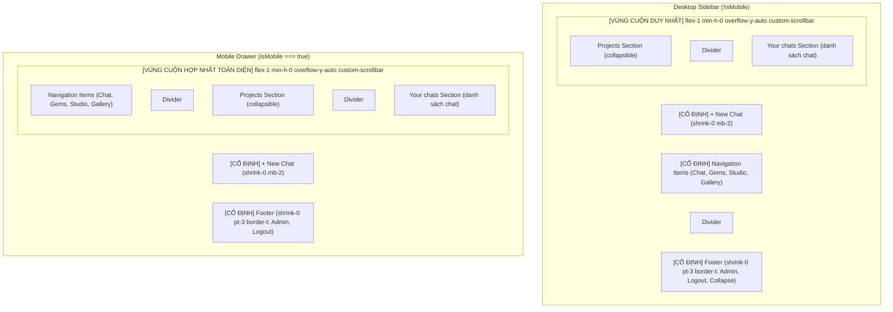

# Implementation Plan: Fix Mobile and Short Viewport Sidebar Scroll Issue (v2 - Revised)

**Date**: 2026-09-27  
**Author**: @planner  
**Status**: Revised - Incorporating PM & Architecture Feedback  
**Target Branch / Environment**: Local workspace  
**Ticket / Issue**: Lỗi UI: "trên mobile và cửa sổ nhỏ/hẹp không có thanh cuộn để cuộn xuống danh sách chat" (Kèm ảnh `media_1790520499503.png`)

---

## 1. Problem Statement & User Report

### Triệu chứng báo cáo:

- Khi người dùng sử dụng ứng dụng trên thiết bị di động (Mobile) hoặc thu nhỏ cửa sổ trình duyệt (cửa sổ có chiều cao ngắn/hẹp, split view, mobile landscape):
  - Thanh cuộn không xuất hiện và người dùng **không thể cuộn xuống để xem danh sách chat (Your chats / Chat History)** hoặc các tùy chọn ở Footer.
- Hình ảnh đính kèm (`media_1790520499503.png`) cho thấy:
  - Header: Logo "Vikini Chat" cùng một vòng tròn xám rỗng ở góc trên bên phải (nút đóng mobile bị thiếu icon `X`).
  - Cụm nút Actions: `+ New Chat`, `Chat`, `Explore Gems`, `Manage Personas`, `Image Studio`, `Gallery` chiếm tới hơn một nửa màn hình.
  - Section Projects: `PROJECTS (1)`, `+ New project`, `CD`.
  - Divider mỏng ở dưới.
  - Phía dưới Divider: Chỉ có một mép nhỏ bị cắt cụt (mép trên của icon MessageSquare / Your chats), hoàn toàn không thể nhìn thấy danh sách hội thoại và không thể vuốt/cuộn xuống được.
  - Góc trái dưới cùng có mép icon tròn của FloatingMenuTrigger nổi đè lên trên drawer.

---

## 2. Root Cause Analysis (RCA)

Khảo sát mã nguồn tại `src/app/features/sidebar/components/Sidebar.tsx`, `ChatApp.tsx`, `FloatingMenuTrigger.tsx` và `src/app/styles/themes/_shared/` xác định các nguyên nhân cốt lõi:

### Root Cause 1: Xung đột Flexbox và Chiều cao (Height Breakdown) trong Mobile Drawer

- Trong `Sidebar.tsx`, Mobile Drawer sử dụng Radix Dialog + Framer Motion:
  ```tsx
  <motion.aside className="fixed top-0 left-0 bottom-0 z-50 w-[85vw] max-w-sm border-r border-(--border) bg-(--surface-muted) p-6 pb-24 shadow-2xl flex flex-col md:hidden">
    <div className="mb-8 flex items-center justify-between">...</div>
    {renderSidebarContent(true)}
  </motion.aside>
  ```
- **Lỗi tràn do `h-full` trong Flex child**:
  `renderSidebarContent` có container root là `<div className="flex flex-col h-full text-(--text-primary)">`.
  Trong CSS Flexbox, khi một phần tử con đặt `height: 100%` (`h-full`) sau một phần tử anh em (Header cao ~32px + `mb-8` 32px = 64px), nó nhận 100% chiều cao của parent. Kết quả là tổng chiều cao = `64px + 100%`, khiến phần đáy của `renderSidebarContent` bị đẩy tràn ra ngoài đáy `motion.aside` khoảng 64px.
- **Tổn hại padding**: `pb-24` (padding-bottom 96px) đã có từ commit đầu tiên nhằm tránh bottom toolbar của iOS Safari (do `layout.tsx` không có `viewportFit: "cover"`, `env(safe-area-inset-bottom)` bằng 0). Tuy nhiên 96px là quá lớn khi kết hợp với `p-6` (24px), lấy đi tới **120px** không gian màn hình của thiết bị di động.

### Root Cause 2: Quá nhiều phần tử cố định (`shrink-0`) & phân mảnh thành các Scroll Zones riêng biệt

- Bên trong `renderSidebarContent`:
  1. Nhóm **Actions** (6 nút điều hướng: New Chat, Chat, Gems, Personas, Image Studio, Gallery) nằm ngoài mọi vùng cuộn, chiếm cứng ~308px.
  2. Section **Projects** được bọc trong một vùng cuộn độc lập:
     `<div className="max-h-[40%] overflow-y-auto pr-1 shrink-0 ...">`
     Thuộc tính `shrink-0` ngăn không cho Section này co lại khi màn hình hẹp, chiếm cứng thêm ~100px.
  3. Section **Your chats** được bọc trong một vùng cuộn độc lập khác:
     `<div className="flex-1 min-h-0 overflow-y-auto pr-1 ...">`
  4. Nhóm **Footer** chiếm thêm ~60-90px.
- **Hệ quả**:
  Tổng chiều cao các phần cố định:
  `64px (Header) + 308px (Actions) + 100px (Projects) + 60px (Footer) + 120px (Padding) = 652px`!
  Khi viewport height trên mobile hoặc cửa sổ ngắn <= 667px (như iPhone SE 667px, mobile landscape ~350px, hoặc chia đôi màn hình desktop):
  - Section "Your chats" có `min-h-0` bị ép chiều cao thực tế về **0px** hoặc chỉ còn vài pixel chớm ở mép đáy.
  - Vì bản thân Sidebar và `motion.aside` KHÔNG PHẢI là một scroll container, người dùng vuốt/cuộn vào vùng Actions hay Projects đều không thể cuộn cả sidebar xuống được.
  - Người dùng hoàn toàn bị "kẹt cứng" không thể tiếp cận danh sách chat.

### Root Cause 3: Lỗi giao diện phụ (Secondary Issues)

- **Nút Close Sidebar trên Mobile thiếu icon `X`**:
  Dòng 566-570 `<Dialog.Close asChild><button aria-label="Close sidebar" ...></button></Dialog.Close>` không có icon nào bên trong, tạo thành một vòng tròn rỗng không rõ mục đích.
- **Xung đột Z-Index với FloatingMenuTrigger**:
  Trong `ChatApp.tsx`, `FloatingMenuTrigger` (`z-50 bottom-24 left-4`) được render sau `Sidebar` (`z-50`), khiến nút trigger nổi đè lên trên góc dưới bên trái của Mobile Drawer.
- **Lỗi Collapsed Placeholder**:
  Dòng 450: `{isCollapsed && <div className="flex-1 flex flex-col items-center pt-4 border-t border-(--border) gap-2" />}`. Nếu vùng cuộn chính cũng có `flex-1`, khi sidebar thu gọn, 2 phần tử `flex-1` này sẽ chia đôi 50/50 chiều cao, làm các icon button bị ép lại và đường kẻ `border-t` nằm lơ lửng ở giữa sidebar.

---

## 3. UI Polish & Cross-Browser Enhancement: `.custom-scrollbar`

> [!NOTE]
> Vấn đề scrollbar không phải là Root Cause gây mất danh sách chat (trên mobile scrollbar là dạng overlay, trên desktop `base.css:168` đã có global 6px `::-webkit-scrollbar`). Đây là hạng mục **Polish & UI Enhancement** quan trọng.

### Chrome 121+ CSS Scrollbar Precedence Quirk

- Từ Chrome 121 (đầu năm 2024), Blink hỗ trợ standard CSS `scrollbar-width` và `scrollbar-color`.
- Khi cả hai được khai báo cùng lúc với `::-webkit-scrollbar*`, Chrome ưu tiên standard properties và **bỏ qua hoàn toàn các quy tắc `::-webkit-scrollbar*`** (dẫn đến mất custom width 5px và hover color trên Chrome).
- **Giải pháp chuẩn xác**: Đặt standard properties chỉ trong nhánh Firefox bằng `@supports not selector(::-webkit-scrollbar)`:

  ```css
  .custom-scrollbar::-webkit-scrollbar {
    width: 5px;
  }
  .custom-scrollbar::-webkit-scrollbar-track {
    background: transparent;
  }
  .custom-scrollbar::-webkit-scrollbar-thumb {
    background: var(--control-border);
    border-radius: 9999px;
  }
  .custom-scrollbar::-webkit-scrollbar-thumb:hover {
    background: var(--border);
  }

  @supports not selector(::-webkit-scrollbar) {
    .custom-scrollbar {
      scrollbar-width: thin;
      scrollbar-color: var(--control-border) transparent;
    }
  }
  ```

### Phạm vi ảnh hưởng (Blast Radius) của `.custom-scrollbar`

Class `.custom-scrollbar` hiện đã được khai báo ở 8 component trong codebase nhưng chưa có định nghĩa CSS (trước đó nhận fallback scrollbar hệ thống):

1. `ModelSelector.tsx:162`
2. `HeaderBar.tsx:171`
3. `IconPicker.tsx:142`
4. `GemsManager.tsx:224`
5. `PersonasManager.tsx:263`
6. `Canvas.tsx:297`
7. `ControlPanel.tsx:411`
8. `StyleSelector.tsx:81`
   Việc định nghĩa class này sẽ mang lại thanh cuộn 5px mảnh, tinh tế và đồng bộ token màu cho toàn bộ 8 component trên mà không gây regression.

---

## 4. Quyết Định Thiết Kế: Desktop vs Mobile UX (Phương Án A)

Chúng tôi lựa chọn **Phương Án A (Tách biệt tối ưu theo `isMobile`)** thay vì gộp chung:



### Rationale cho Phương Án A:

1. **Bảo toàn Desktop UX cho màn hình lớn**:
   - Trên desktop màn hình bình thường (800px+), Navigation links không bị cuộn mất khi người dùng duyệt danh sách chat. Trải nghiệm người dùng nhất quán, quen thuộc.
   - Vùng Projects và Your chats được hợp nhất vào chung 1 scroll container `flex-1 min-h-0` (bỏ `max-h-[40%] overflow-y-auto shrink-0`), giải quyết triệt để lỗi Your chats bị ép mất khi cửa sổ desktop bị thu nhỏ.
2. **Tối đa hóa không gian trên Mobile**:
   - Trên mobile (`isMobile === true`), toàn bộ Navigation links + Projects + Your chats nằm trong 1 luồng cuộn duy nhất. Người dùng vuốt ngón tay nhẹ nhàng từ Navigation lướt thẳng xuống danh sách chat. Không bao giờ bị ép chiều cao về 0px, không bị kẹt ngón tay giữa các vùng cuộn con.
   - Nút `+ New Chat` vẫn luôn cố định trên cùng để 1 chạm tạo chat mới tức thì.
3. **Xử lý triệt để Collapsed Desktop Mode**:
   - Loại bỏ hoàn toàn placeholder `flex-1` ở dòng 450.
   - Thêm `isCollapsed && "border-t border-(--border)"` vào footer để hiển thị đường phân cách ngay trên các icon action khi thu gọn.
4. **Tối ưu an toàn cho Mobile Drawer & iOS Safari**:
   - Điều chỉnh padding drawer: `p-5 pb-16` (thay vì `pb-24` 96px). 64px (`pb-16`) vừa lấy lại được 32px quý giá cho danh sách chat, vừa giữ khoảng cách an toàn cho thanh bottom toolbar của iOS Safari trên thiết bị thật.
   - Header mobile: Giảm `mb-8` xuống `mb-4 shrink-0`.
   - Bổ sung `<X className="w-5 h-5" />` vào nút close.
5. **Khắc phục FloatingMenuTrigger Overlap**:
   - Đặt `Dialog.Content` (Mobile Drawer) với `z-[60]` (cao hơn `FloatingMenuTrigger` `z-50`), hoặc trong `ChatApp.tsx`, chỉ render FloatingMenuTrigger khi drawer không mở: `{!mobileOpen && <FloatingMenuTrigger ... />}`.

---

## 5. File Changes & Minimal Diffs Specification

Chỉ tác động chính xác **3 files** (Sidebar, ChatApp, utilities.css) + 1 file test mới:

### File 1: `src/app/features/sidebar/components/Sidebar.tsx`

- **Imports**: Thêm `X` từ `lucide-react`.
- **`renderSidebarContent`**:
  - Root container: `className="flex flex-col flex-1 min-h-0 text-(--text-primary)"` (bỏ `h-full` cạnh `flex-1 min-h-0`).
  - Tách nút `+ New Chat` thành header cố định: `<div className="shrink-0 mb-2">...</div>`.
  - Trên desktop (`!isMobile`): Render `navButtons` cố định phía trên vùng cuộn.
  - Vùng cuộn `custom-scrollbar`:
    - Trên mobile (`isMobile`): Render `navButtons` + divider bên trong vùng cuộn.
    - Projects Section: Render trực tiếp bên trong vùng cuộn (bỏ wrapper `max-h-[40%] overflow-y-auto pr-1 shrink-0`).
    - Your chats Section: Render trực tiếp bên trong vùng cuộn (bỏ wrapper `flex-1 min-h-0 overflow-y-auto pr-1`).
  - Loại bỏ hoàn toàn placeholder `flex-1` khi `isCollapsed` (dòng 450).
  - Footer Actions: `className={cn("shrink-0 pt-3 space-y-2", !isCollapsed && "border-t border-(--border)", isCollapsed && "border-t border-(--border)")}` (bỏ `mt-auto` thừa).
- **Mobile Drawer**:
  - `motion.aside`: `className="fixed top-0 left-0 bottom-0 z-[60] w-[85vw] max-w-sm border-r border-(--border) bg-(--surface-muted) p-5 pb-16 shadow-2xl flex flex-col md:hidden"`.
  - Mobile Header: `className="mb-4 flex items-center justify-between shrink-0"`.
  - Close button: Chèn `<X className="w-5 h-5" />`.

### File 2: `src/app/features/chat/components/ChatApp.tsx`

- Ẩn `FloatingMenuTrigger` khi mobile drawer đang mở:
  ```tsx
  {
    !mobileOpen && <FloatingMenuTrigger onClick={() => setMobileOpen(true)} />;
  }
  ```
  Tránh tình trạng trigger nổi đè lên trên mép dưới của mobile drawer.

### File 3: `src/app/styles/themes/_shared/utilities.css`

- Bổ sung class `.custom-scrollbar` hỗ trợ chuẩn Webkit và Firefox Chrome 121+ safe:

  ```css
  /* ===========================================
     CUSTOM SCROLLBAR - Subtle & Theme-Aware
     =========================================== */
  .custom-scrollbar::-webkit-scrollbar {
    width: 5px;
  }

  .custom-scrollbar::-webkit-scrollbar-track {
    background: transparent;
  }

  .custom-scrollbar::-webkit-scrollbar-thumb {
    background: var(--control-border);
    border-radius: 9999px;
  }

  .custom-scrollbar::-webkit-scrollbar-thumb:hover {
    background: var(--border);
  }

  @supports not selector(::-webkit-scrollbar) {
    .custom-scrollbar {
      scrollbar-width: thin;
      scrollbar-color: var(--control-border) transparent;
    }
  }
  ```

### File 4: `src/app/features/sidebar/components/Sidebar.test.tsx` (Test mới)

- Tạo unit test kiểm tra:
  - Cấu trúc render Desktop (`collapsed = false` và `collapsed = true`).
  - Cấu trúc render Mobile (`isMobile = true` / drawer mở).
  - Xác nhận container cuộn có các class `flex-1 min-h-0 overflow-y-auto`.
  - Xác nhận placeholder `flex-1` không còn tồn tại khi `isCollapsed`.

---

## 6. Verification & Quality Gates

### Tier 1: Type Checking

- Lệnh: `npm run type-check`
- Yêu cầu: 0 type errors (`tsc --noEmit` pass 100%).

### Tier 2: Lint & Code Standards

- Lệnh: `npm run lint`
- Yêu cầu: ESLint pass, tuân thủ `rules/01-coding.md`.

### Tier 3: Unit Tests

- Lệnh: `npm run test:run`
- Yêu cầu: Tất cả bài test hệ thống và test mới `Sidebar.test.tsx` pass 100%.

### Tier 4: Manual Responsive & Cross-Browser Verification

1. **Mobile Portrait Viewport (375x667 - iPhone SE)**:
   - Mở sidebar: Icon `X` hiển thị rõ ràng trên nút close.
   - Nút `FloatingMenuTrigger` không bị nổi đè lên drawer.
   - Nút `+ New Chat` cố định trên cùng.
   - Vuốt nhẹ ngón tay: Danh sách từ Navigation -> Projects -> Your chats cuộn mượt mà.
   - Danh sách chat hiển thị đầy đủ, không bị cắt cụt.
2. **Mobile Landscape Viewport (667x350 - Chiều cao cực ngắn)**:
   - Xoay ngang màn hình (chiều cao ~350px).
   - Xác nhận toàn bộ nội dung trong drawer vẫn cuộn được đầy đủ từ đầu đến cuối mà không bị kẹt.
3. **Desktop Short Window Viewport (1200x500 - Chiều cao ngắn)**:
   - Thu nhỏ chiều cao cửa sổ xuống ~500px.
   - Xác nhận Navigation vẫn cố định ở trên.
   - Projects và Your chats cuộn mượt mà trong vùng cuộn duy nhất bên dưới.
   - Thanh cuộn mảnh 5px xuất hiện ở cạnh phải.
4. **Desktop Collapsed Mode (Chiều rộng 80px)**:
   - Bấm nút Collapse.
   - Xác nhận các icon hiển thị cân đối, không có placeholder chiếm 50% chiều cao, footer có đường kẻ ngăn cách gọn gàng.
5. **Component Blast Radius Check (.custom-scrollbar)**:
   - Mở `ModelSelector` và `IconPicker` hoặc `GemsManager`.
   - Xác nhận thanh cuộn trong dropdown/picker hiển thị mảnh 5px bo tròn, đúng màu theme token.
6. **Theme Switching**:
   - Đổi qua lại giữa các theme Focus (Blueprint, Charcoal), Glassmorphism (Nebula), và RA2 (Soviet, Yuri).
   - Xác nhận màu thanh cuộn `.custom-scrollbar` tự động thích ứng với biến `--control-border` của từng theme.

---

## 7. Living Docs Update Plan

Sau khi cài đặt thành công và vượt qua quality gates:

1. `docs/CHANGELOG.md`: Thêm mục ghi nhận bản vá lỗi cuộn danh sách chat trên mobile và cửa sổ hẹp (v2).
2. `docs/lessons-learned.md`: Lưu lại bài học kinh nghiệm về Flexbox height overflow trong mobile drawer, Chrome 121+ CSS scrollbar quirk, và nguyên tắc tránh chia nhỏ multiple nested scroll zones trong không gian hiển thị hẹp.
