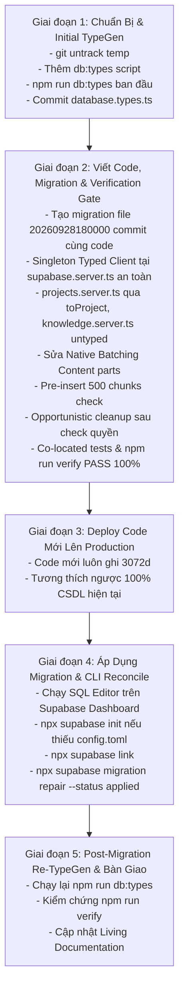

# Kế Hoạch Triển Khai: Thiết Lập Supabase CLI Automation, Tự Động Hóa Type Generation, Thống Nhất Duy Nhất Mô Hình Embedding gemini-embedding-2 (3072d), Native Batch Resilience & Tối Ưu Search Latency

**Ngày lập**: 2026-09-28  
**Phiên bản**: Revision 9 (Tích hợp đầy đủ 8 khuyến nghị Minor từ Claude Code CLI Audit Run 1: Khóa cứng VECTOR(3072) trong DDL, Thu hẹp WHERE filter lỗi document, toProject() cho mọi hàm project, Bỏ lookup thừa trong searchKnowledge, npx tsx & dotenv v17 quiet, CLI auth prerequisites, Lessons Learned timeout & cleanup)  
**Tác giả**: @planner  
**Trạng thái**: Ready for Review (Đã tích hợp 8 khuyến nghị Minor, sẵn sàng Audit Run 2)  
**Môi trường thực thi**: Local Workspace (`wyemh/vikini` trên Windows PowerShell)  
**Mục tiêu chính**: Khắc phục triệt để mâu thuẫn TypeGen ban đầu bằng quy trình 5 giai đoạn tuần tự; Khởi tạo duy nhất 1 singleton client trong `supabase.server.ts` bảo toàn đầy đủ fallback env và error handling; Tạo file migration DDL ngay tại Giai đoạn 2 để review và commit cùng code trước deploy; Scoped Typed Client tại `projects.server.ts` qua mapper `toProject()` cho MỌI hàm trả về project; Giữ `knowledge.server.ts` untyped; Chống treo tài liệu với Opportunistic Cleanup bọc non-blocking sau kiểm quyền; Native Batching SDK `@google/genai` chuẩn mảng Content; Bảo toàn chữ ký Postgres RPC `match_project_knowledge` trong transaction DDL kèm khóa cứng `VECTOR(3072)`; Pre-insert validation kiểm tra giới hạn 500 chunks (~350–400 KB text); Tách biệt retry policy và làm sạch translation keys.

---

## 1. Mục Tiêu (Goal)

1. **Khắc Phục Lỗi "Con Gà Và Quả Trứng" Của TypeGen Qua Quy Trình 5 Giai Đoạn**:
   - **Giai đoạn 1 (Chuẩn Bị & Initial TypeGen)**:
     - Chạy `git rm -r --cached supabase/.temp` và bổ sung `supabase/.temp/` vào `.gitignore`.
     - Thêm script `"db:types"` vào `package.json` (chưa thêm `"db:push"` để loại trừ nguy cơ vô tình áp 4 legacy migrations lệch hướng).
     - Chạy `npm run db:types` để sinh `src/types/database.types.ts` ban đầu từ CSDL remote hiện hữu (nơi các cột `embedding_model` vẫn đang nullable).
     - Commit file `database.types.ts` ban đầu để làm nền tảng type an toàn cho toàn bộ dự án.
   - **Giai đoạn 2 (Phát Triển Mã Nguồn & Verification Gate)**:
     - Tạo file migration `supabase/migrations/20260928180000_unify_gemini_embedding_2.sql` ngay tại Giai đoạn 2 để được review và commit cùng code trước khi deploy.
     - Cập nhật `src/lib/core/supabase.server.ts` với duy nhất 1 singleton client `createClient<Database>`, bảo toàn 100% logic an toàn (`import "@/lib/env"`, `pickFirstEnv` với đầy đủ fallback keys, error messages rõ ràng), export `getSupabaseAdmin(): SupabaseClient` và `getTypedSupabaseAdmin(): SupabaseClient<Database>`.
     - Viết code backend, routes, store, UI và unit tests. Sử dụng mapper `toProject()` gán cứng `"gemini-embedding-2"` cho MỌI hàm đọc/ghi trả về `Project`/`ProjectWithStats` (`getUserProjects`, `getProject`, `createProject`, `updateProject`) để code tương thích 100% với cả 2 phiên bản types (khi nullable và khi NOT NULL), không spread raw DB row thô.
     - Chạy toàn bộ Verification Gate: `npm run verify` (`type-check && lint && test:run`). PHẢI PASS 100% trước khi triển khai lên remote.
   - **Giai đoạn 3 (Deploy Code Mới Lên Production)**:
     - Deploy code mới lên production trước. Code mới luôn tạo và xử lý vector 3072d của `gemini-embedding-2`, hoàn toàn tương thích ngược với CSDL hiện hữu (đã chứa sẵn 12 chunks 3072d).
   - **Giai đoạn 4 (Áp Dụng Migration & CLI Reconcile)**:
     - Người dùng thực thi migration `20260928180000_unify_gemini_embedding_2.sql` (đã commit ở Giai đoạn 2) qua SQL Editor trên Supabase Dashboard.
     - Liên kết CLI: `npx supabase link --project-ref otqhztwogsvsfeuwhrom`. (Nếu CLI yêu cầu `supabase/config.toml`, chạy `npx supabase init` trước).
     - Kiểm tra danh sách: `npx supabase migration list`.
     - Đánh dấu migration đã áp dụng: `npx supabase migration repair --status applied 20260928180000`.
   - **Giai đoạn 5 (Post-Migration Re-TypeGen & Bàn Giao)**:
     - Chạy lại `npm run db:types` để cập nhật `database.types.ts` (các cột `embedding_model` chuyển thành NOT NULL `string`).
     - Chạy lại `npm run verify` kiểm chứng lần cuối và commit file types cập nhật.

2. **Khởi Tạo Singleton Typed Client An Toàn & Áp Dụng Ranh Giới Scoped Client**:
   - `src/lib/core/supabase.server.ts` chỉ khởi tạo duy nhất 1 singleton client: `cachedAdminClient = createClient<Database>(url, serviceKey, { auth: { persistSession: false } })`.
   - Giữ nguyên 100% logic an toàn hiện tại:
     - Giữ `import "@/lib/env";`.
     - Giữ hàm `pickFirstEnv` với đầy đủ danh sách fallback: `NEXT_PUBLIC_SUPABASE_URL` / `SUPABASE_URL` và `SUPABASE_SERVICE_ROLE_KEY` / `SUPABASE_SERVICE_KEY` / `SUPABASE_SERVICE_ROLE` / `SUPABASE_SERVICE` (vì `.env.local` chỉ có `SUPABASE_URL`).
     - Giữ các thông báo lỗi rõ ràng: `throw new Error("Missing Supabase URL")` và `throw new Error("Missing Supabase service role key")`.
     - Hàm `getSupabaseAdmin(): SupabaseClient` trả về chính `cachedAdminClient`.
     - Hàm `getTypedSupabaseAdmin(): SupabaseClient<Database>` trả về chính `cachedAdminClient`.
     - Tuyệt đối không tạo 2 client riêng và không dùng non-null assertion `!`.
   - `knowledge.server.ts` **TIẾP TỤC DÙNG `getSupabaseAdmin()` untyped** trong phạm vi task này. Tránh triệt để lỗi TypeScript TS2322 do `ChunkMetadata` có chữ ký index `[key: string]: unknown` không gán được vào Supabase `Json`, cũng như tránh ép kiểu cưỡng bức `as KnowledgeSearchResult[]`.
   - Chỉ áp dụng `getTypedSupabaseAdmin()` tại `projects.server.ts`, nơi schema bảng `projects` được ánh xạ trực tiếp và làm sạch trọn vẹn qua mapper function `toProject()`. Bắt buộc mọi hàm trả về `Project` hoặc `ProjectWithStats` (`getUserProjects`, `getProject`, `createProject`, `updateProject`) đều chuyển hóa qua `toProject()` (ví dụ: `{ ...toProject(project), conversation_count, ... }`), không spread trực tiếp raw row từ CSDL.

3. **Loại Bỏ Triệt Để `text-embedding-004` & Thống Nhất Duy Nhất Mô Hình `gemini-embedding-2` (3072d)**:
   - Dữ liệu thực tế qua SQL Audit: CSDL hiện hữu có 12 chunks thuộc `gemini-embedding-2` với số chiều đã là `3072` dimensions (không có bất kỳ chunk 768d nào).
   - Loại bỏ hoàn toàn `text-embedding-004` khỏi toàn bộ hệ thống (types, database constraints, API schemas, UI selectors, store, server services).
   - Tên model nội bộ CSDL: `"gemini-embedding-2"`.
   - Mã model gọi Google GenAI API: `GEMINI_EMBEDDING_API_MODEL = "gemini-embedding-2-preview"`.
   - Chiều vector cố định: `3072` dimensions (`outputDimensionality: 3072`).
   - Định dạng bất đối xứng (Asymmetric retrieval formatting) đồng bộ:
     - Document chunking: `formatDocumentForRAG(content, title)`.
     - Search query: `formatQueryForRAG(query)`.
   - Áp đặt ràng buộc CSDL cho cả 2 bảng `projects` và `knowledge_documents`:
     - `NOT NULL` và `DEFAULT 'gemini-embedding-2'`.
     - `CHECK (embedding_model = 'gemini-embedding-2')`.
   - Khóa cứng kiểu cột vector ở mức schema CSDL:
     - `ALTER TABLE knowledge_chunks ALTER COLUMN embedding TYPE VECTOR(3072);`.

4. **Gỡ Bỏ Bộ Chọn Model & Khóa Chặt 3 API Endpoints Với HTTP 400**:
   - Loại bỏ trường `embedding_model` khỏi Zod schema của cả 3 routes (`/api/projects`, `/api/projects/[id]`, `/api/projects/[id]/knowledge`).
   - Loại bỏ `availableModels` khỏi payload trả về của `GET /api/projects`.
   - Chặn nghiêm ngặt (Strict Rejection 400): Kiểm tra raw body của cả 3 endpoints. Nếu client gửi trường `embedding_model`, lập tức trả về `HTTP 400 Bad Request` kèm lỗi `ValidationError`.
   - Gỡ bỏ bộ chọn model radio buttons và object `EMBEDDING_MODEL_INFO` trong [`src/components/features/projects/CreateProjectModal.tsx`](src/components/features/projects/CreateProjectModal.tsx).
   - Xóa bỏ 4 translation keys thừa không còn sử dụng: `embeddingModelLabel`, `freeModelDesc`, `bestModelDesc`, `notAvailableTier`. Không thêm key i18n thừa khi server đã ném trực tiếp message lỗi.

5. **Sửa Lỗi Native Batching SDK `@google/genai` (Content Parts)**:
   - Sửa cấu trúc gọi API sang mảng Content riêng biệt:
     `contents: subBatch.map((text) => ({ role: "user", parts: [{ text }] }))`
     Giúp Google API nhận N Contents và trả về đúng N embeddings (`result.embeddings.length === subBatch.length`).
   - Script standalone `scripts/smoke-embedding.ts` nạp chuẩn `.env.local` qua `dotenv.config({ path: ".env.local", quiet: true })` (tương thích `dotenv` v17 không bị spam banner log), kiểm tra cả single embedding (3072d) và batch embedding (2–3 texts). Chạy bằng lệnh: `npx tsx scripts/smoke-embedding.ts`.

6. **Bảo Toàn 100% Chữ Ký RPC `match_project_knowledge` & Bọc Transaction**:
   - Giữ nguyên chữ ký nhận vào: `p_project_id UUID, query_embedding VECTOR(3072), match_threshold FLOAT DEFAULT 0.7, match_count INT DEFAULT 5`.
   - Giữ nguyên cấu trúc trả về: `RETURNS TABLE (id UUID, document_id UUID, filename TEXT, content TEXT, metadata JSONB, similarity FLOAT)`.
   - Giữ nguyên `SECURITY DEFINER`, `JOIN knowledge_documents kd ON kd.id = kc.document_id`, và `AND kd.status = 'ready'`.
   - Chỉ bổ sung đúng 1 điều kiện an toàn: `AND vector_dims(kc.embedding) = 3072`.
   - Thêm lệnh DDL khóa cứng: `ALTER TABLE knowledge_chunks ALTER COLUMN embedding TYPE VECTOR(3072);` khóa cứng số chiều ở mức schema, ngăn chặn vĩnh viễn lỗi lệch chiều pgvector.
   - Bọc toàn bộ migration trong block transaction `BEGIN; ... COMMIT;`.

7. **Pre-Insert Validation: Kiểm Tra Giới Hạn 500 Chunks (~350–400 KB Text)**:
   - Trong `uploadDocument()`: Chunking và kiểm tra `chunks.length > 500` TRƯỚC KHI insert bản ghi vào `knowledge_documents`. Tránh tạo bản ghi rác và không làm lãng phí hạn ngạch tài liệu của người dùng.
   - Kiểm tra dung lượng file tối đa 5MB (`MAX_FILE_SIZE_BYTES = 5 * 1024 * 1024`).

8. **Kích Hoạt Opportunistic Cleanup Sau Khi Kiểm Quyền & Cron Resilience**:
   - Trong `GET /api/projects/[id]/knowledge/route.ts`: Gọi `cleanupStuckProcessingDocuments(projectId)` đặt SAU bước kiểm tra quyền sở hữu project (`const project = await getProject(projectId, userId);`). Bọc trong `try/catch` non-blocking để không bao giờ làm gián đoạn danh sách tài liệu.
   - Thêm `export const maxDuration = 60;` cho Route Handler upload/list tài liệu.
   - Trong `src/app/api/cron/cleanup/route.ts`: Giữ nguyên `export const POST = GET`, dùng `Promise.allSettled([cleanupExpiredFiles(), cleanupStuckProcessingDocuments()])`, và ghi log đầy đủ `deleted=${fileResult.deleted}, errors=${fileResult.errors}, stuck docs cleaned=${stuckDocsCleaned}`.

9. **Tối Ưu Search Latency & Nhận Diện Lỗi Chuẩn Xác**:
   - Trong `knowledge.server.ts`: Loại bỏ hoàn toàn khối mã tải sample chunk và **xóa bỏ truy vấn thừa `projects.embedding_model` cùng option `options.embeddingModel`** trong `searchKnowledge()`, tiết kiệm 1 round-trip DB tới Supabase giúp giảm thiểu latency cho RAG query.
   - Phân biệt retry: Search query tối đa 1 retry (`SEARCH_MAX_RETRIES = 1`), upload retry tối đa 3 lần (`UPLOAD_MAX_RETRIES = 3`).
   - Nhận diện lỗi bằng `instanceof ApiError` từ `@google/genai` (chỉ retry status 429, 503, 500).

---

## 2. Tài Liệu Cần Tham Chiếu (Pre-Work Reading)

Tuân thủ nghiêm ngặt bảng Pre-Work Protocol tại [`.agents/rules/02-quality.md`](.agents/rules/02-quality.md):

| Tài liệu / Quy chuẩn                      | Đường dẫn tương đối                                                            | Trọng tâm kiểm tra                                                                                                                                                                             |
| :---------------------------------------- | :----------------------------------------------------------------------------- | :--------------------------------------------------------------------------------------------------------------------------------------------------------------------------------------------- |
| **Database Schema**                       | [`docs/database-schema.md`](docs/database-schema.md)                           | Dòng 334 (`projects.embedding_model`), dòng 381 (`knowledge_chunks.embedding` 3072d note), bảng `knowledge_documents`, hàm RPC `match_project_knowledge`.                                      |
| **Contracts Specification**               | [`docs/contracts.md`](docs/contracts.md)                                       | Dòng 210 (`Project.embeddingModel`), dòng 349 (`CreateProjectRequest`), dòng 358 (`UpdateProjectRequest`), dòng 366 (`UploadDocumentRequest`), `KnowledgeSearchResult` chứa trường `filename`. |
| **Features Specification**                | [`docs/features.md`](docs/features.md)                                         | Dòng 299 (§ 2.10 Projects): Cập nhật tự động phân đoạn (chunking) và vector hóa sang `gemini-embedding-2` 3072 chiều.                                                                          |
| **Lessons Learned**                       | [`docs/lessons-learned.md`](docs/lessons-learned.md)                           | Tra cứu tiền lệ lỗi RAG vector mismatch, `as any` type bypass, SDK `@google/genai` native batching format, và bài học về Serverless timeout.                                                   |
| **Database Migration Skill**              | [`.agents/skills/database-migration.md`](.agents/skills/database-migration.md) | Quy chuẩn migration Supabase, tính lũy tiến (idempotency), transaction `BEGIN; ... COMMIT;`, RLS policies, connection settings và reconcile migration history.                                 |
| **API Patterns Skill**                    | [`.agents/skills/api-patterns.md`](.agents/skills/api-patterns.md)             | Chuẩn API Route (Validate → Execute → Respond), session auth, Zod validation, kiểm tra raw body chặn `embedding_model`, `AppError` handling.                                                   |
| **Coding Standards**                      | [`.agents/rules/01-coding.md`](.agents/rules/01-coding.md)                     | TypeScript strict mode, TUYỆT ĐỐI CẤM `any`, unknown narrowing, type guard an toàn, ranh giới kiến trúc.                                                                                       |
| **Quality Gates**                         | [`.agents/rules/02-quality.md`](.agents/rules/02-quality.md)                   | Verification Tier 2 (`npm run verify`), co-located test requirement, cú pháp PowerShell terminal (dùng `;`), Test Failure Triage.                                                              |
| **Google GenAI Embeddings Documentation** | [Google AI Docs](https://ai.google.dev/gemini-api/docs/embeddings)             | Chi tiết về model `gemini-embedding-2-preview`, `contents: Content[]` hỗ trợ native batching với `parts: [{ text }]`, và cấu hình `outputDimensionality: 3072`.                                |

---

## 3. Assumptions & Cross-Task Dependencies

### 3.1. Các Giả Định Kỹ Thuật (Assumptions)

1. **Hiện Trạng CSDL Thực Tế (SQL Audit Confirmation)**:
   - Dữ liệu thực tế qua câu lệnh SQL Audit cho thấy:
     - 1 dự án (`projects`), 1 tài liệu (`knowledge_documents`), 12 đoạn chunks (`knowledge_chunks`).
     - Toàn bộ 12 chunks ĐÃ LÀ `gemini-embedding-2` và CÓ ĐÚNG `3072` dimensions.
     - Không tồn tại bất kỳ chunk 768 chiều nào trong hệ thống.
   - Hệ quả an toàn: Câu lệnh xóa chunks lệch chiều (`DELETE ... WHERE vector_dims <> 3072`) sẽ ảnh hưởng 0 bản ghi, không tài liệu nào bị lỗi, và việc áp đặt ràng buộc `CHECK` / `NOT NULL` diễn ra trơn tru mà không làm gián đoạn dữ liệu hiện có.

2. **Quy Trình 5 Giai Đoạn Xử Lý Mâu Thuẫn TypeGen**:
   - Tránh việc viết code phụ thuộc vào `database.types.ts` trước khi file này tồn tại.
   - Giai đoạn 1 sinh `database.types.ts` ban đầu từ CSDL remote hiện tại.
   - File migration `20260928180000_unify_gemini_embedding_2.sql` được tạo ngay tại Giai đoạn 2 để được code review và commit cùng mã nguồn trước khi deploy.
   - Mapper `toProject()` gán cứng `embedding_model: "gemini-embedding-2"` giúp code biên dịch sạch sẽ dù type từ DB ban đầu là nullable hay sau này là `string`.
   - Sau khi deploy code và áp migration, Giai đoạn 5 chạy lại `npm run db:types` để chuyển cột sang NOT NULL.

3. **Singleton Typed Client & Scoped Boundaries**:
   - Khởi tạo 1 singleton client duy nhất `createClient<Database>` trong `supabase.server.ts`. Bảo toàn 100% logic an toàn hiện tại: `import "@/lib/env"`, `pickFirstEnv` với đầy đủ fallback keys, và các thông báo lỗi rõ ràng. Cả `getSupabaseAdmin()` và `getTypedSupabaseAdmin()` cùng trả về instance này mà không dùng `!`.
   - `projects.server.ts` sử dụng `getTypedSupabaseAdmin()`. Các câu lệnh SELECT/INSERT/UPDATE được type-check chặt chẽ theo schema CSDL.
   - `knowledge.server.ts` tiếp tục sử dụng `getSupabaseAdmin()` untyped để tránh xung đột giữa `ChunkMetadata` (`[key: string]: unknown`) và `Json` của Supabase.

4. **Định Dạng Batching `@google/genai` 2.10.0**:
   - SDK gộp mảng `string[]` thành 1 Content duy nhất có nhiều parts, khiến API chỉ trả về 1 vector.
   - Cấu trúc bắt buộc để nhận về N vectors:
     ```typescript
     contents: subBatch.map((text) => ({
       role: "user",
       parts: [{ text }],
     }));
     ```

5. **Bảo Toàn Chữ Ký RPC & An Toàn Migration**:
   - Giữ nguyên toàn bộ tham số (kèm `DEFAULT 0.7` và `DEFAULT 5`).
   - Giữ nguyên cột trả về `filename TEXT` trong `RETURNS TABLE`.
   - Bọc migration trong transaction `BEGIN; ... COMMIT;`.

6. **Opportunistic Cleanup An Toàn Sau Khi Kiểm Quyền**:
   - Trong `GET /api/projects/[id]/knowledge`: Chỉ gọi sau khi `getProject(projectId, userId)` xác nhận người dùng sở hữu project.
   - Bọc trong `try/catch` non-blocking để không bao giờ làm gián đoạn việc tải danh sách tài liệu.

7. **Giới Hạn Thực Tế 500 Chunks (~350–400 KB Text)**:
   - Kiểm tra `chunks.length > 500` và `contentBytes > 5MB` TRƯỚC KHI insert DB.

### 3.2. Quan Hệ Phụ Thuộc Chéo (Cross-Task Dependencies)



---

## 4. Bảng Verified Versions (Tra Cứu Thực Tế 2026)

| Thư viện / Công cụ          | Phiên bản thực tế                                 | Trạng thái tương thích & Ghi chú kỹ thuật 2026                                                                                                                                                 |
| :-------------------------- | :------------------------------------------------ | :--------------------------------------------------------------------------------------------------------------------------------------------------------------------------------------------- |
| **`@supabase/supabase-js`** | `^2.89.0` (Cài đặt: `2.91.0`)                     | Cung cấp generic `SupabaseClient<Database>`. Khởi tạo 1 singleton duy nhất `createClient<Database>(url, key, { auth: { persistSession: false } })`.                                            |
| **`@google/genai`**         | `^2.10.0` (Cài đặt: `2.10.0`)                     | SDK Google GenAI chính thức. Model ID: `gemini-embedding-2-preview`. Hỗ trợ: `ApiError`, native batching qua mảng Content `{ role: "user", parts: [{ text }] }`, `outputDimensionality: 3072`. |
| **`supabase` (CLI)**        | `^2.70.5` (Cục bộ: `2.89.1`, Registry: `2.118.0`) | Hỗ trợ lệnh `gen types typescript --project-id ... --schema public`, `init`, `link`, và `migration repair`.                                                                                    |
| **`next`**                  | `^16.1.1` (App Router)                            | App Router, Node.js 24 runtime, Serverless execution, Route Handlers với `export const maxDuration = 60;`.                                                                                     |
| **`react`**                 | `^19.2.3`                                         | React 19 production mode, server functions, batched state reconciliation.                                                                                                                      |
| **`typescript`**            | `^5.9.3`                                          | TypeScript 5.9 strict mode (`noImplicitAny`, `strictNullChecks`, `noUncheckedIndexedAccess`).                                                                                                  |
| **`zod`**                   | `^4.2.1`                                          | Zod 4 runtime schema parser, hỗ trợ `.strict()`, `.refine()` và custom validation errors.                                                                                                      |
| **`vitest`**                | `^4.0.17`                                         | Framework test co-located, hỗ trợ mock modules in-memory và fake timers.                                                                                                                       |
| **`dotenv`**                | `^17.2.3` (Cài đặt: `17.2.3`)                     | Nạp biến môi trường cho standalone scripts với `dotenv.config({ path: ".env.local", quiet: true })` tắt banner log.                                                                            |

---

## 5. Files Cần Chỉnh Sửa / Tạo Mới

Phân loại chi tiết theo quy chuẩn `[NEW]`, `[MODIFY]`, `[DELETE]`:

| Trạng thái     | Đường dẫn file                                                                                                                       | Mô tả thay đổi kỹ thuật                                                                                                                                                                                                                                                                                                                                                                                                                                                                                                                                                                                                       |
| :------------- | :----------------------------------------------------------------------------------------------------------------------------------- | :---------------------------------------------------------------------------------------------------------------------------------------------------------------------------------------------------------------------------------------------------------------------------------------------------------------------------------------------------------------------------------------------------------------------------------------------------------------------------------------------------------------------------------------------------------------------------------------------------------------------------- | --- | -------------------- | --- | ------- |
| **`[NEW]`**    | [`supabase/migrations/20260928180000_unify_gemini_embedding_2.sql`](supabase/migrations/20260928180000_unify_gemini_embedding_2.sql) | Tạo ngay ở Giai đoạn 2 cùng với mã nguồn để được code review và commit trước khi deploy: Bọc toàn bộ trong `BEGIN; ... COMMIT;`. Đánh dấu error tài liệu có chunk <> 3072d, xóa chunks <> 3072d, khóa cứng `ALTER TABLE knowledge_chunks ALTER COLUMN embedding TYPE VECTOR(3072);`, cập nhật NOT NULL & DEFAULT `'gemini-embedding-2'`, CHECK constraint trên cả `projects` và `knowledge_documents`. Cập nhật RPC `match_project_knowledge` bảo toàn 100% chữ ký tham số (kèm DEFAULT), giữ `RETURNS TABLE` có `filename`, `SECURITY DEFINER`, `JOIN knowledge_documents`, chỉ thêm `AND vector_dims(kc.embedding) = 3072`. |
| **`[NEW]`**    | [`src/types/database.types.ts`](src/types/database.types.ts)                                                                         | File TypeScript định nghĩa types của CSDL Supabase sinh tự động bởi `npm run db:types`. Sinh lần đầu ở Giai đoạn 1 và cập nhật lại ở Giai đoạn 5.                                                                                                                                                                                                                                                                                                                                                                                                                                                                             |
| **`[NEW]`**    | [`scripts/smoke-embedding.ts`](scripts/smoke-embedding.ts)                                                                           | Script độc lập: Có `import dotenv from "dotenv"; dotenv.config({ path: ".env.local", quiet: true });` tự nạp đúng file môi trường `.env.local` của repo (chạy bằng `npx tsx scripts/smoke-embedding.ts`), gọi API Google GenAI thật kiểm tra kết nối single embedding (3072d) và batch embedding 2–3 text chunks với format Content parts, assert `embeddings.length === texts.length`.                                                                                                                                                                                                                                       |
| **`[NEW]`**    | [`src/lib/features/projects/projects.server.test.ts`](src/lib/features/projects/projects.server.test.ts)                             | Bộ unit test co-located cho `projects.server.ts` bao phủ 8 hàm export, kiểm tra model mặc định luôn là `"gemini-embedding-2"`, và các giá trị fallback hiển thị qua mapper `toProject()`.                                                                                                                                                                                                                                                                                                                                                                                                                                     |
| **`[NEW]`**    | [`src/lib/features/projects/knowledge.server.test.ts`](src/lib/features/projects/knowledge.server.test.ts)                           | Bộ unit test co-located cho `knowledge.server.ts`: Kiểm tra upload limits (5MB, 500 chunks ~350-400 KB text), chunk limit check diễn ra TRƯỚC KHI insert DB, loại bỏ sample chunk khi search, và cơ chế dọn stuck documents > 15 phút.                                                                                                                                                                                                                                                                                                                                                                                        |
| **`[NEW]`**    | [`src/lib/features/projects/embedding.server.test.ts`](src/lib/features/projects/embedding.server.test.ts)                           | Bộ unit test co-located cho `embedding.server.ts`: Mock `@google/genai`, kiểm tra Native Batching truyền mảng Content `{ role: "user", parts: [{ text }] }`, assert 3072 dimensions, nhận diện lỗi `instanceof ApiError` với `{ status: 429, message: "Rate limit" }`, retry phân biệt (search max 1, upload max 3) với fake timers (`< 100ms`).                                                                                                                                                                                                                                                                              |
| **`[MODIFY]`** | [`src/types/projects.ts`](src/types/projects.ts)                                                                                     | Đổi `EmbeddingModel = "gemini-embedding-2"`. Xóa `embeddingModels` khỏi `PROJECT_LIMITS`. Bỏ `embedding_model` khỏi `CreateProjectInput` và `UpdateProjectInput`. Khai báo `MAX_FILE_SIZE_BYTES = 5 * 1024 * 1024` và `MAX_CHUNKS_PER_UPLOAD = 500`.                                                                                                                                                                                                                                                                                                                                                                          |
| **`[MODIFY]`** | [`src/lib/core/supabase.server.ts`](src/lib/core/supabase.server.ts)                                                                 | Khởi tạo duy nhất 1 singleton client `createClient<Database>`, bảo toàn 100% logic an toàn: `import "@/lib/env"`, `pickFirstEnv` với đầy đủ fallback keys (`NEXT_PUBLIC_SUPABASE_URL` / `SUPABASE_URL` và `SUPABASE_SERVICE_ROLE_KEY` / `SUPABASE_SERVICE_KEY` / `SUPABASE_SERVICE_ROLE` / `SUPABASE_SERVICE`), và các câu ném lỗi rõ ràng. Cả `getSupabaseAdmin(): SupabaseClient` và `getTypedSupabaseAdmin(): SupabaseClient<Database>` cùng trả về instance singleton này mà không dùng non-null assertion `!`.                                                                                                           |
| **`[MODIFY]`** | [`src/lib/features/projects/projects.server.ts`](src/lib/features/projects/projects.server.ts)                                       | Dùng `getTypedSupabaseAdmin()`. `toProject()` chuẩn hóa và gán cứng `embedding_model: "gemini-embedding-2"`. MỌI hàm trả về `Project` hoặc `ProjectWithStats` (`getUserProjects`, `getProject`, `createProject`, `updateProject`) đều phải đi qua `toProject(row)` (không spread raw row thô). `createProject()` luôn ghi `"gemini-embedding-2"`. `updateProject()` không nhận và không cập nhật `embedding_model`. Giữ các giá trị fallback hiển thị (`created_at: row.created_at                                                                                                                                            |     | ""`, `icon: row.icon |     | "📁"`). |
| **`[MODIFY]`** | [`src/lib/features/projects/knowledge.server.ts`](src/lib/features/projects/knowledge.server.ts)                                     | **Tiếp tục dùng `getSupabaseAdmin()` untyped**. Kiểm tra kích thước file (5MB) và số chunks (500 chunks ~350-400 KB text) TRƯỚC KHI insert bản ghi `knowledge_documents`. Loại bỏ hoàn toàn sample chunk và xóa bỏ truy vấn thừa `projects.embedding_model` cùng option `options.embeddingModel` khỏi `searchKnowledge()` (tiết kiệm 1 round-trip DB). Export hàm `cleanupStuckProcessingDocuments(projectId?: string)`. Bỏ tham số `embeddingModel` khỏi `uploadDocument()` và `searchKnowledge()`.                                                                                                                          |
| **`[MODIFY]`** | [`src/lib/features/projects/embedding.server.ts`](src/lib/features/projects/embedding.server.ts)                                     | Khai báo `GEMINI_EMBEDDING_API_MODEL = "gemini-embedding-2-preview"`, `EMBEDDING_DIMENSION = 3072`, `NATIVE_BATCH_SIZE = 50`, `UPLOAD_MAX_RETRIES = 3`, `SEARCH_MAX_RETRIES = 1`. Triển khai Native Batching gửi `contents: subBatch.map((text) => ({ role: "user", parts: [{ text }] }))`. Nhận diện lỗi bằng `instanceof ApiError`. Gỡ bỏ `getUserTier` và `getEmbeddingDimension()`.                                                                                                                                                                                                                                       |
| **`[MODIFY]`** | [`src/app/api/cron/cleanup/route.ts`](src/app/api/cron/cleanup/route.ts)                                                             | Giữ nguyên `export const POST = GET`. Dùng `Promise.allSettled([cleanupExpiredFiles(), cleanupStuckProcessingDocuments()])`. Log đầy đủ `deleted=${fileResult.deleted}, errors=${fileResult.errors}, stuck docs cleaned=${stuckDocsCleaned}`.                                                                                                                                                                                                                                                                                                                                                                                 |
| **`[MODIFY]`** | [`src/app/api/projects/[id]/knowledge/route.ts`](src/app/api/projects/[id]/knowledge/route.ts)                                       | Thêm `export const maxDuration = 60;`. Gọi `cleanupStuckProcessingDocuments(projectId)` đặt SAU bước kiểm tra quyền sở hữu `getProject()`, bọc trong `try/catch` non-blocking. Chặn raw body chứa `embedding_model` trả về HTTP 400. Kiểm tra kích thước file 5MB.                                                                                                                                                                                                                                                                                                                                                            |
| **`[MODIFY]`** | [`src/app/api/projects/route.ts`](src/app/api/projects/route.ts)                                                                     | Xóa `embedding_model` khỏi `createProjectSchema`. Chặn raw body chứa `embedding_model` ném `ValidationError` HTTP 400. Bỏ `availableModels` khỏi kết quả GET.                                                                                                                                                                                                                                                                                                                                                                                                                                                                 |
| **`[MODIFY]`** | [`src/app/api/projects/[id]/route.ts`](src/app/api/projects/[id]/route.ts)                                                           | Xóa `embedding_model` khỏi `updateProjectSchema`. Chặn raw body chứa `embedding_model` ném `ValidationError` HTTP 400.                                                                                                                                                                                                                                                                                                                                                                                                                                                                                                        |
| **`[MODIFY]`** | [`src/components/features/projects/CreateProjectModal.tsx`](src/components/features/projects/CreateProjectModal.tsx)                 | Gỡ bỏ toàn bộ UI bộ chọn model, `EMBEDDING_MODEL_INFO`, `allModels`, `embeddingModel` state và `useEffect` tự chọn model.                                                                                                                                                                                                                                                                                                                                                                                                                                                                                                     |
| **`[MODIFY]`** | [`src/lib/store/projectStore.ts`](src/lib/store/projectStore.ts)                                                                     | Loại bỏ `availableModels` khỏi `ProjectLimits`. Loại bỏ `embedding_model` khỏi input của `createProject` và `updateProject`.                                                                                                                                                                                                                                                                                                                                                                                                                                                                                                  |
| **`[MODIFY]`** | [`src/lib/utils/translations/en.ts`](src/lib/utils/translations/en.ts)                                                               | Xóa 4 keys cũ: `embeddingModelLabel`, `freeModelDesc`, `bestModelDesc`, `notAvailableTier`. Không thêm key thừa vì server ném trực tiếp lỗi.                                                                                                                                                                                                                                                                                                                                                                                                                                                                                  |
| **`[MODIFY]`** | [`src/lib/utils/translations/vi.ts`](src/lib/utils/translations/vi.ts)                                                               | Xóa 4 keys cũ: `embeddingModelLabel`, `freeModelDesc`, `bestModelDesc`, `notAvailableTier`. Không thêm key thừa.                                                                                                                                                                                                                                                                                                                                                                                                                                                                                                              |
| **`[MODIFY]`** | [`package.json`](package.json)                                                                                                       | Thêm script `"db:types"` ở Giai đoạn 1. (Chưa thêm `"db:push"`).                                                                                                                                                                                                                                                                                                                                                                                                                                                                                                                                                              |
| **`[MODIFY]`** | [`.gitignore`](.gitignore)                                                                                                           | Thêm `supabase/.temp/`.                                                                                                                                                                                                                                                                                                                                                                                                                                                                                                                                                                                                       |
| **`[MODIFY]`** | [`.prettierignore`](.prettierignore)                                                                                                 | Thêm `src/types/database.types.ts`.                                                                                                                                                                                                                                                                                                                                                                                                                                                                                                                                                                                           |
| **`[MODIFY]`** | [`eslint.config.mjs`](eslint.config.mjs)                                                                                             | Thêm `"src/types/database.types.ts"` trực tiếp vào mảng `ignores`.                                                                                                                                                                                                                                                                                                                                                                                                                                                                                                                                                            |
| **`[MODIFY]`** | [`src/app/api/projects/route.test.ts`](src/app/api/projects/route.test.ts)                                                           | Test POST body có `embedding_model` trả về HTTP 400. Test GET không chứa `availableModels`.                                                                                                                                                                                                                                                                                                                                                                                                                                                                                                                                   |
| **`[MODIFY]`** | [`src/app/api/projects/[id]/route.test.ts`](src/app/api/projects/[id]/route.test.ts)                                                 | Test PATCH body có `embedding_model` trả về HTTP 400.                                                                                                                                                                                                                                                                                                                                                                                                                                                                                                                                                                         |
| **`[MODIFY]`** | [`src/app/api/projects/[id]/knowledge/route.test.ts`](src/app/api/projects/[id]/knowledge/route.test.ts)                             | Test upload body có `embedding_model` trả về HTTP 400. Test file > 5MB trả về HTTP 400. Test GET gọi `cleanupStuckProcessingDocuments` sau auth.                                                                                                                                                                                                                                                                                                                                                                                                                                                                              |
| **`[MODIFY]`** | [`src/app/api/cron/cleanup/route.test.ts`](src/app/api/cron/cleanup/route.test.ts)                                                   | Cập nhật mock và assertion kiểm tra `Promise.allSettled`, gọi đồng thời `cleanupExpiredFiles()` và `cleanupStuckProcessingDocuments()`, log đầy đủ errors.                                                                                                                                                                                                                                                                                                                                                                                                                                                                    |
| **`[MODIFY]`** | [`docs/database-schema.md`](docs/database-schema.md)                                                                                 | Sửa default `embedding_model` thành `'gemini-embedding-2'`. Cập nhật vector embedding chuẩn 3072 chiều. Cập nhật chữ ký RPC `match_project_knowledge` có `vector_dims = 3072` và bảo toàn `filename`. Bổ sung mục Supabase CLI Architecture.                                                                                                                                                                                                                                                                                                                                                                                  |
| **`[MODIFY]`** | [`docs/contracts.md`](docs/contracts.md)                                                                                             | Đổi `embeddingModel` thành `"gemini-embedding-2"`. Loại bỏ `embedding_model` khỏi 3 request interfaces. Giữ trường `filename` trong `KnowledgeSearchResult`.                                                                                                                                                                                                                                                                                                                                                                                                                                                                  |
| **`[MODIFY]`** | [`docs/features.md`](docs/features.md)                                                                                               | Cập nhật phân đoạn 3072d và cơ chế Native Batching mảng Content.                                                                                                                                                                                                                                                                                                                                                                                                                                                                                                                                                              |
| **`[MODIFY]`** | [`docs/lessons-learned.md`](docs/lessons-learned.md)                                                                                 | Ghi nhận bài học kinh nghiệm: Quy trình 5 giai đoạn loại trừ mâu thuẫn typegen, Singleton Typed Client vs JSON type mismatch, Native Batching `@google/genai` Content parts format, bảo toàn chữ ký Postgres RPC, opportunistic cleanup sau auth, pre-insert chunk limit validation, và giới hạn đã biết về 500 chunks (~10 batches tuần tự với retries) có thể tiệm cận timeout 60s được bù đắp bởi cleanup 15 phút.                                                                                                                                                                                                         |
| **`[MODIFY]`** | [`.agents/skills/database-migration.md`](.agents/skills/database-migration.md)                                                       | Cập nhật quy trình deploy code trước migration sau, migration repair, và bọc transaction cho DDL.                                                                                                                                                                                                                                                                                                                                                                                                                                                                                                                             |
| **`[MODIFY]`** | [`docs/CHANGELOG.md`](docs/CHANGELOG.md)                                                                                             | Ghi nhận bản cập nhật Revision 9 hoàn chỉnh.                                                                                                                                                                                                                                                                                                                                                                                                                                                                                                                                                                                  |

---

## 6. Các Bước Thực Hiện Tuần Tự

### Giai đoạn 1: Chuẩn Bị & Initial TypeGen (Giải Quyết Lỗi "Con Gà Và Quả Trứng")

- [ ] **Bước 1.1: Git untrack thư mục tạm và cấu hình ignores**:
  - Thực thi lệnh PowerShell:
    ```powershell
    git rm -r --cached supabase/.temp
    ```
    _(Nếu git báo file không được track thì bỏ qua)._
  - Thêm `supabase/.temp/` vào [`.gitignore`](.gitignore).
  - Thêm `src/types/database.types.ts` vào [`.prettierignore`](.prettierignore) và mảng `ignores` của [`eslint.config.mjs`](eslint.config.mjs).

- [ ] **Bước 1.2: Thêm script `"db:types"` vào [`package.json`](package.json)**:
  - Thêm script tạo type:
    ```json
    "db:types": "supabase gen types typescript --project-id otqhztwogsvsfeuwhrom --schema public > src/types/database.types.ts"
    ```
  - _Lưu ý_: Chưa thêm script `"db:push"` ở giai đoạn này để ngăn chặn rủi ro vô tình đẩy 4 legacy migrations cũ lên database.

- [ ] **Bước 1.3: Chạy Initial Type Generation (CLI Prerequisites)**:
  - **Điều kiện tiên quyết**: Lệnh `supabase gen types --project-id` yêu cầu CLI đã được xác thực. Hãy đảm bảo đã chạy `npx supabase login` hoặc có biến môi trường `SUPABASE_ACCESS_TOKEN` trong phiên làm việc.
  - **Môi trường thực thi an toàn**: Script `npm run db:types` trong `package.json` thực thi qua `cmd.exe` của npm, đảm bảo toán tử redirect `>` ghi file dưới chuẩn UTF-8. _(Khuyến cáo: Không chạy lệnh gốc trực tiếp trên PowerShell 5.1 bằng toán tử `>` vì PowerShell 5.1 sẽ tự động mã hóa file thành UTF-16 LE)._
  - Chạy lệnh:
    ```powershell
    npm run db:types
    ```
  - File `src/types/database.types.ts` được tạo mới, chứa toàn bộ schema hiện tại của remote database (lúc này các cột `embedding_model` vẫn đang nullable).

- [ ] **Bước 1.4: Commit file `database.types.ts` ban đầu**:
  - Commit file `src/types/database.types.ts` vào git để làm điểm tựa type cho các bước code tiếp theo.

---

### Giai đoạn 2: Phát Triển Mã Nguồn & Verification Gate

- [ ] **Bước 2.1: Tạo File Migration DDL [`supabase/migrations/20260928180000_unify_gemini_embedding_2.sql`](supabase/migrations/20260928180000_unify_gemini_embedding_2.sql)**:
  - _Tạo ngay ở Giai đoạn 2 (cùng lúc viết code)_ để file được code review, kiểm tra cú pháp và commit cùng mã nguồn trước khi deploy.
  - Bọc toàn bộ trong `BEGIN; ... COMMIT;`.
  - Giữ nguyên 100% chữ ký tham số RPC (kèm DEFAULT), giữ `RETURNS TABLE` có `filename`, `SECURITY DEFINER`, `JOIN knowledge_documents`, chỉ bổ sung `AND vector_dims(kc.embedding) = 3072`:

    ```sql
    -- ============================================================================
    -- Migration: Unify Gemini Embedding 2 (3072d) & Clean Legacy Chunks
    -- ============================================================================

    BEGIN;

    -- 1. Đánh dấu lỗi các tài liệu có chunks bị lệch chiều (khác 3072d)
    -- (Thu hẹp điều kiện: chỉ đánh dấu error các tài liệu thực sự có chunk lệch chiều, các tài liệu hợp lệ có embedding_model NULL sẽ được chuẩn hóa ở bước sau)
    UPDATE knowledge_documents
    SET status = 'error',
        error_message = 're-upload required (embedding model upgraded to gemini-embedding-2)',
        embedding_model = 'gemini-embedding-2',
        updated_at = now()
    WHERE id IN (
      SELECT DISTINCT document_id
      FROM knowledge_chunks
      WHERE embedding IS NOT NULL AND vector_dims(embedding) <> 3072
    );

    -- 2. Xóa triệt để các chunks có số chiều vector khác 3072
    DELETE FROM knowledge_chunks
    WHERE embedding IS NOT NULL AND vector_dims(embedding) <> 3072;

    -- 2b. Khóa cứng số chiều vector ở mức schema CSDL: 3072 dimensions
    -- (Khóa chặt ở tầng schema, loại bỏ hoàn toàn nguy cơ lệch chiều ở mức pgvector)
    ALTER TABLE knowledge_chunks ALTER COLUMN embedding TYPE VECTOR(3072);

    -- 3. Cập nhật các tài liệu còn lại sang gemini-embedding-2
    UPDATE knowledge_documents
    SET embedding_model = 'gemini-embedding-2'
    WHERE embedding_model IS NULL OR embedding_model <> 'gemini-embedding-2';

    -- 4. Cập nhật tất cả dự án sang gemini-embedding-2
    UPDATE projects
    SET embedding_model = 'gemini-embedding-2'
    WHERE embedding_model IS NULL OR embedding_model <> 'gemini-embedding-2';

    -- 5. Áp đặt NOT NULL, DEFAULT và CHECK Constraint cho bảng projects
    ALTER TABLE projects ALTER COLUMN embedding_model SET NOT NULL;
    ALTER TABLE projects ALTER COLUMN embedding_model SET DEFAULT 'gemini-embedding-2';
    ALTER TABLE projects DROP CONSTRAINT IF EXISTS chk_projects_embedding_model;
    ALTER TABLE projects ADD CONSTRAINT chk_projects_embedding_model CHECK (embedding_model = 'gemini-embedding-2');

    -- 6. Áp đặt NOT NULL, DEFAULT và CHECK Constraint cho bảng knowledge_documents
    ALTER TABLE knowledge_documents ALTER COLUMN embedding_model SET NOT NULL;
    ALTER TABLE knowledge_documents ALTER COLUMN embedding_model SET DEFAULT 'gemini-embedding-2';
    ALTER TABLE knowledge_documents DROP CONSTRAINT IF EXISTS chk_knowledge_documents_embedding_model;
    ALTER TABLE knowledge_documents ADD CONSTRAINT chk_knowledge_documents_embedding_model CHECK (embedding_model = 'gemini-embedding-2');

    -- 7. Cập nhật RPC match_project_knowledge: Bảo toàn 100% chữ ký & kiểu trả về, chỉ thêm vector_dims = 3072
    CREATE OR REPLACE FUNCTION match_project_knowledge(
      p_project_id UUID,
      query_embedding VECTOR(3072),
      match_threshold FLOAT DEFAULT 0.7,
      match_count INT DEFAULT 5
    )
    RETURNS TABLE (
      id UUID,
      document_id UUID,
      filename TEXT,
      content TEXT,
      metadata JSONB,
      similarity FLOAT
    )
    LANGUAGE plpgsql
    SECURITY DEFINER
    AS $$
    BEGIN
      RETURN QUERY
      SELECT
        kc.id,
        kc.document_id,
        kd.filename,
        kc.content,
        kc.metadata,
        1 - (kc.embedding <=> query_embedding) AS similarity
      FROM knowledge_chunks kc
      JOIN knowledge_documents kd ON kd.id = kc.document_id
      WHERE kc.project_id = p_project_id
        AND kd.status = 'ready'
        AND vector_dims(kc.embedding) = 3072
        AND 1 - (kc.embedding <=> query_embedding) > match_threshold
      ORDER BY kc.embedding <=> query_embedding
      LIMIT match_count;
    END;
    $$;

    COMMIT;
    ```

- [ ] **Bước 2.2: Cập nhật Types trong [`src/types/projects.ts`](src/types/projects.ts)**:
  - Rút gọn type chỉ còn 1 giá trị duy nhất:
    ```typescript
    export type EmbeddingModel = "gemini-embedding-2";
    export const MAX_FILE_SIZE_BYTES = 5 * 1024 * 1024; // 5MB
    export const MAX_CHUNKS_PER_UPLOAD = 500; // Tối đa 500 chunks (~350–400 KB text) mỗi tài liệu
    ```
  - Xóa thuộc tính `embeddingModels` khỏi các hạng trong `PROJECT_LIMITS`.
  - Cập nhật `CreateProjectInput` và `UpdateProjectInput`: Loại bỏ hoàn toàn trường `embedding_model`.
  - Giữ nguyên trường `filename` trong interface `KnowledgeSearchResult`:
    ```typescript
    export interface KnowledgeSearchResult {
      id: string;
      document_id: string;
      filename: string;
      content: string;
      metadata: ChunkMetadata;
      similarity: number;
    }
    ```

- [ ] **Bước 2.3: Triển khai Singleton Typed Client trong [`src/lib/core/supabase.server.ts`](src/lib/core/supabase.server.ts)**:
  - **Giữ nguyên 100% logic an toàn hiện tại**:
    - Giữ `import "@/lib/env";`.
    - Giữ hàm `pickFirstEnv` với đầy đủ danh sách fallback: `NEXT_PUBLIC_SUPABASE_URL` / `SUPABASE_URL` và `SUPABASE_SERVICE_ROLE_KEY` / `SUPABASE_SERVICE_KEY` / `SUPABASE_SERVICE_ROLE` / `SUPABASE_SERVICE` (vì `.env.local` chỉ có `SUPABASE_URL`).
    - Giữ các thông báo lỗi rõ ràng: `throw new Error("Missing Supabase URL")` và `throw new Error("Missing Supabase service role key")`.
    - Khởi tạo **duy nhất 1 singleton client**: `cachedAdminClient = createClient<Database>(url, serviceKey, { auth: { persistSession: false } });`.
    - Hàm `getSupabaseAdmin(): SupabaseClient` trả về chính `cachedAdminClient`.
    - Hàm `getTypedSupabaseAdmin(): SupabaseClient<Database>` trả về chính `cachedAdminClient`.
    - Tuyệt đối không tạo 2 client riêng và không dùng non-null assertion `!`.
  - Mã nguồn hoàn chỉnh:

    ```typescript
    // /lib/core/supabase.ts
    // Validate environment variables on import
    import "@/lib/env";

    import { createClient, SupabaseClient } from "@supabase/supabase-js";
    import type { Database } from "@/types/database.types";

    /**
     * Global cache for Supabase admin client to implement Singleton pattern.
     */
    let cachedAdminClient: SupabaseClient<Database> | null = null;

    /**
     * Picks the first available environment variable from a list of possible keys.
     */
    function pickFirstEnv(keys: string[]): string {
      for (const k of keys) {
        const v = process.env[k];
        if (v && String(v).trim()) return String(v).trim();
      }
      return "";
    }

    function initAdminClient(): SupabaseClient<Database> {
      if (cachedAdminClient) return cachedAdminClient;

      const url = pickFirstEnv(["NEXT_PUBLIC_SUPABASE_URL", "SUPABASE_URL"]);
      const serviceKey = pickFirstEnv([
        "SUPABASE_SERVICE_ROLE_KEY",
        "SUPABASE_SERVICE_KEY",
        "SUPABASE_SERVICE_ROLE",
        "SUPABASE_SERVICE",
      ]);

      if (!url) throw new Error("Missing Supabase URL");
      if (!serviceKey) throw new Error("Missing Supabase service role key");

      cachedAdminClient = createClient<Database>(url, serviceKey, {
        auth: { persistSession: false },
      });

      return cachedAdminClient;
    }

    /**
     * Returns a singleton instance of Supabase admin client with service role permissions.
     * Untyped SupabaseClient for backward compatibility.
     */
    export function getSupabaseAdmin(): SupabaseClient {
      return initAdminClient();
    }

    /**
     * Returns a singleton instance of Supabase admin client with full Database type safety.
     */
    export function getTypedSupabaseAdmin(): SupabaseClient<Database> {
      return initAdminClient();
    }
    ```

- [ ] **Bước 2.4: Refactor [`src/lib/features/projects/embedding.server.ts`](src/lib/features/projects/embedding.server.ts) (Sửa Native Batching & Retry Resilience)**:
  - Làm sạch mã nguồn: Gỡ bỏ import thừa `getUserTier`. Xóa hoàn toàn hàm `getEmbeddingDimension()`, `MODEL_DIMENSIONS`, `isEmbedding2`, `getDefaultEmbeddingModel`, `isModelAvailableForTier`, `getValidatedEmbeddingModel`.
  - Định nghĩa các hằng số chuẩn hóa:

    ```typescript
    import { GoogleGenAI, ApiError } from "@google/genai";
    import { logger } from "@/lib/utils/logger";

    const embeddingLogger = logger.withContext("embedding");

    export const GEMINI_EMBEDDING_API_MODEL = "gemini-embedding-2-preview";
    export const EMBEDDING_DIMENSION = 3072;
    export const NATIVE_BATCH_SIZE = 50; // Tối đa 50 texts trong 1 request
    export const UPLOAD_MAX_RETRIES = 3; // Upload tài liệu retry tối đa 3 lần
    export const SEARCH_MAX_RETRIES = 1; // Search query chỉ retry tối đa 1 lần để tối ưu latency
    export const EMBEDDING_INITIAL_RETRY_DELAY_MS = 1000;
    ```

  - Nhận diện lỗi API chuẩn xác bằng `instanceof ApiError`:
    ```typescript
    export function isRetryableApiError(error: unknown): boolean {
      if (error instanceof ApiError) {
        return error.status === 429 || error.status === 503 || error.status === 500;
      }
      return false;
    }
    ```
  - Cơ chế Retry Exponential Backoff với Jitter (hỗ trợ test runner config):

    ```typescript
    export interface RetryOptions {
      maxRetries?: number;
      initialDelayMs?: number;
    }

    export async function withEmbeddingRetry<T>(
      fn: () => Promise<T>,
      options: RetryOptions = {}
    ): Promise<T> {
      const maxRetries = options.maxRetries ?? UPLOAD_MAX_RETRIES;
      const initialDelayMs = options.initialDelayMs ?? EMBEDDING_INITIAL_RETRY_DELAY_MS;
      let attempt = 0;

      while (true) {
        try {
          return await fn();
        } catch (error) {
          attempt++;
          if (attempt > maxRetries || !isRetryableApiError(error)) {
            throw error;
          }
          const jitter = initialDelayMs === 0 ? 0 : Math.random() * 200;
          const delay =
            initialDelayMs === 0
              ? 0
              : Math.min(initialDelayMs * Math.pow(2, attempt - 1) + jitter, 10000);
          embeddingLogger.warn(
            `Gemini Embedding transient error. Retrying attempt ${attempt}/${maxRetries} after ${Math.round(delay)}ms...`
          );
          if (delay > 0) {
            await new Promise((resolve) => setTimeout(resolve, delay));
          }
        }
      }
    }
    ```

  - Hàm `generateEmbedding(content: string)` cho Search RAG (Retry max 1):

    ```typescript
    export async function generateEmbedding(
      content: string,
      retryOptions?: RetryOptions
    ): Promise<number[]> {
      const client = getClient();
      const options: RetryOptions = {
        maxRetries: retryOptions?.maxRetries ?? SEARCH_MAX_RETRIES,
        initialDelayMs: retryOptions?.initialDelayMs,
      };

      return withEmbeddingRetry(async () => {
        const result = await client.models.embedContent({
          model: GEMINI_EMBEDDING_API_MODEL,
          contents: content,
          config: { outputDimensionality: EMBEDDING_DIMENSION },
        });

        const values = result.embeddings?.[0]?.values;
        if (!values || values.length !== EMBEDDING_DIMENSION) {
          throw new Error(
            `Invalid embedding returned: expected ${EMBEDDING_DIMENSION} dimensions, got ${values?.length ?? 0}`
          );
        }
        return values;
      }, options);
    }
    ```

  - Hàm `generateEmbeddingsBatch(contents: string[])` - SỬA LỖI NATIVE BATCHING:

    ```typescript
    export async function generateEmbeddingsBatch(
      contents: string[],
      retryOptions?: RetryOptions
    ): Promise<number[][]> {
      if (contents.length === 0) return [];
      const client = getClient();
      const allEmbeddings: number[][] = [];
      const options: RetryOptions = {
        maxRetries: retryOptions?.maxRetries ?? UPLOAD_MAX_RETRIES,
        initialDelayMs: retryOptions?.initialDelayMs,
      };

      for (let i = 0; i < contents.length; i += NATIVE_BATCH_SIZE) {
        const subBatch = contents.slice(i, i + NATIVE_BATCH_SIZE);

        const batchResults = await withEmbeddingRetry(async () => {
          // BẮT BUỘC: Truyền mảng Content objects với parts: [{ text }]
          // Tuyệt đối không truyền string[] trực tiếp để tránh SDK gộp thành 1 Content duy nhất!
          const result = await client.models.embedContent({
            model: GEMINI_EMBEDDING_API_MODEL,
            contents: subBatch.map((text) => ({
              role: "user",
              parts: [{ text }],
            })),
            config: { outputDimensionality: EMBEDDING_DIMENSION },
          });

          if (!result.embeddings || result.embeddings.length !== subBatch.length) {
            throw new Error(
              `Batch embedding length mismatch: expected ${subBatch.length}, got ${result.embeddings?.length ?? 0}`
            );
          }

          return result.embeddings.map((emb, idx) => {
            const values = emb.values;
            if (!values || values.length !== EMBEDDING_DIMENSION) {
              throw new Error(
                `Invalid embedding at index ${idx}: expected ${EMBEDDING_DIMENSION} dimensions, got ${values?.length ?? 0}`
              );
            }
            return values;
          });
        }, options);

        allEmbeddings.push(...batchResults);
      }

      return allEmbeddings;
    }
    ```

  - Định dạng retrieval bất đối xứng:

    ```typescript
    export function formatQueryForRAG(query: string): string {
      return `task: question answering | query: ${query}`;
    }

    export function formatDocumentForRAG(content: string, title?: string): string {
      const safeTitle = title || "none";
      return `title: ${safeTitle} | text: ${content}`;
    }
    ```

- [ ] **Bước 2.5: Tạo Standalone Script Smoke Test [`scripts/smoke-embedding.ts`](scripts/smoke-embedding.ts)**:
  - Dùng `dotenv.config({ path: ".env.local", quiet: true })` để tự nạp chính xác file `.env.local` của repo khi chạy độc lập mà không bị in banner log của `dotenv` v17.
  - Chạy bằng lệnh: `npx tsx scripts/smoke-embedding.ts`.
  - _Ghi chú về ES Modules Hoisting_: Do cơ chế hoist, `embedding.server` được nạp trước khi `dotenv.config()` thực thi, tuy nhiên mã nguồn `embedding.server.ts` khởi tạo client Google GenAI một cách lazy bên trong hàm `getClient()` nên biến môi trường `GEMINI_API_KEY` vẫn được đọc chuẩn xác 100%.

    ```typescript
    import dotenv from "dotenv";
    dotenv.config({ path: ".env.local", quiet: true });

    import {
      generateEmbedding,
      generateEmbeddingsBatch,
      GEMINI_EMBEDDING_API_MODEL,
    } from "../src/lib/features/projects/embedding.server";

    async function smokeTest() {
      console.log(`Starting smoke test with model: ${GEMINI_EMBEDDING_API_MODEL}...`);

      // 1. Single test
      console.log("1. Testing single embedding...");
      const singleVector = await generateEmbedding(
        "Vikini knowledge retrieval smoke test single query"
      );
      if (singleVector.length !== 3072) {
        throw new Error(
          `Single embedding failed: expected 3072 dimensions, got ${singleVector.length}`
        );
      }
      console.log("✓ Single embedding OK: Exactly 3072 dimensions returned.");

      // 2. Batch test
      console.log("2. Testing batch embedding with multiple chunks...");
      const testChunks = [
        "First chunk text for Vikini batch test.",
        "Second chunk text for Vikini batch test with different content.",
        "Third chunk text verifying independent embeddings generation.",
      ];
      const batchVectors = await generateEmbeddingsBatch(testChunks);
      if (batchVectors.length !== testChunks.length) {
        throw new Error(
          `Batch embedding failed: expected ${testChunks.length} vectors, got ${batchVectors.length}`
        );
      }
      for (let i = 0; i < batchVectors.length; i++) {
        if (batchVectors[i].length !== 3072) {
          throw new Error(
            `Chunk ${i} failed: expected 3072 dimensions, got ${batchVectors[i].length}`
          );
        }
      }
      console.log(
        `✓ Batch embedding OK: Exactly ${batchVectors.length} vectors of 3072d returned.`
      );
      console.log("ALL SMOKE TESTS PASSED!");
      process.exit(0);
    }

    smokeTest().catch((err) => {
      console.error("SMOKE TEST ERROR:", err);
      process.exit(1);
    });
    ```

- [ ] **Bước 2.6: Refactor [`src/lib/features/projects/projects.server.ts`](src/lib/features/projects/projects.server.ts) (Áp Dụng Scoped Typed Client & Mapper `toProject`)**:
  - Dùng `getTypedSupabaseAdmin()`.
  - Định nghĩa mapper `toProject(row)`:

    ```typescript
    import type { Tables } from "@/types/database.types";

    function toProject(row: Tables<"projects">): Project {
      return {
        id: row.id,
        user_id: row.user_id,
        name: row.name,
        description: row.description,
        icon: row.icon || "📁",
        color: row.color,
        embedding_model: "gemini-embedding-2", // Gán cứng, tương thích tuyệt đối dù row từ DB ban đầu là nullable! (TypeScript contextual-type tự động khớp với literal EmbeddingModel)
        created_at: row.created_at || "",
        updated_at: row.updated_at || "",
      };
    }
    ```

  - **Bắt buộc chuyển hóa qua `toProject(row)` cho MỌI hàm trả về `Project` hoặc `ProjectWithStats`**:
    - Không bao giờ spread raw row thô (`...project`) từ CSDL vì row có kiểu `embedding_model: string | null` và `icon: string | null` sẽ gây lỗi type-check khi gán vào `ProjectWithStats`.
    - Trong `getUserProjects()` và `getProject()`, luôn dùng:
      ```typescript
      return {
        ...toProject(project),
        conversation_count: convCount,
        document_count: docStats.count,
        storage_bytes: docStats.totalBytes,
      };
      ```
    - Trong `createProject()`: Luôn trả về `toProject(data)` và khởi tạo `embedding_model: "gemini-embedding-2"`.
    - Trong `updateProject()`: Luôn trả về `toProject(data)` và loại bỏ hoàn toàn trường `embedding_model` khỏi payload cập nhật CSDL.

- [ ] **Bước 2.7: Refactor [`src/lib/features/projects/knowledge.server.ts`](src/lib/features/projects/knowledge.server.ts) (Untyped An Toàn & Pre-Insert Validation 500 Chunks)**:
  - **Giữ nguyên `getSupabaseAdmin()` untyped** để tránh lỗi TS2322 với `ChunkMetadata`.
  - **Tối ưu Search Knowledge (Zero Sample Overhead & Zero Extra DB Round-trip)**:
    - Loại bỏ hoàn toàn việc tải sample chunk (dòng 274-324).
    - **Xóa bỏ truy vấn thừa `projects.embedding_model`** (dòng 255-263) và loại bỏ option `options.embeddingModel` khỏi chữ ký của `searchKnowledge()`, tiết kiệm 1 round-trip DB tới Supabase giúp giảm thiểu RAG query latency.
    - Format query với `formatQueryForRAG(query)`, gọi `generateEmbedding` và truyền trực tiếp vector 3072d vào RPC `match_project_knowledge`.
  - **Upload Knowledge - Kiểm tra trước khi Insert DB**:

    ```typescript
    export async function uploadDocument(input: UploadDocumentInput): Promise<KnowledgeDocument> {
      const supabase = getSupabaseAdmin();

      // 1. Validate file type
      if (!isSupportedFileType(input.filename)) {
        throw new ValidationError(`Unsupported file type: ${input.filename}`);
      }

      // 2. Check content size (5MB max)
      const contentBytes = Buffer.byteLength(input.content, "utf8");
      if (contentBytes > MAX_FILE_SIZE_BYTES) {
        throw new ValidationError("File size exceeds 5MB limit");
      }

      // 3. Check storage limits & tier
      const tier = await getUserTier(input.userId);
      const limits = getTierLimits(tier);
      const storageCheck = await canAddStorageToProject(
        input.projectId,
        input.userId,
        contentBytes
      );
      if (!storageCheck.allowed) {
        const maxMB = Math.round(storageCheck.maxBytes / (1024 * 1024));
        const usedMB = Math.round(storageCheck.currentBytes / (1024 * 1024));
        throw new Error(`Storage limit exceeded. Project uses ${usedMB}MB of ${maxMB}MB allowed.`);
      }

      // 4. Check document count limit
      const existingDocs = await getProjectDocuments(input.projectId, input.userId);
      if (existingDocs.length >= limits.maxDocsPerProject) {
        throw new Error(
          `Document limit reached. Maximum ${limits.maxDocsPerProject} documents per project.`
        );
      }

      // 5. Pre-insert Validation: Chunking & validate chunks count BEFORE inserting into database!
      const chunks = chunkContent(input.content, input.filename);
      if (chunks.length === 0) {
        throw new ValidationError("No content to process");
      }
      if (chunks.length > MAX_CHUNKS_PER_UPLOAD) {
        throw new ValidationError("Document exceeds maximum 500 chunks limit (~350–400 KB text)");
      }

      // 6. Insert document record (status: processing) ONLY after passing chunk validation
      const { data: doc, error: createError } = await supabase
        .from("knowledge_documents")
        .insert({
          project_id: input.projectId,
          user_id: input.userId,
          filename: input.filename,
          mime_type: input.mimeType || getMimeType(input.filename),
          size_bytes: contentBytes,
          embedding_model: "gemini-embedding-2",
          status: "processing",
        })
        .select()
        .single();

      if (createError || !doc) {
        kbLogger.error("Failed to create document", createError);
        throw new Error("Failed to create document");
      }

      try {
        // 7. Format chunks and generate embeddings in native batch
        const chunkTexts = chunks.map((c) => formatDocumentForRAG(c.content, input.filename));
        const embeddings = await generateEmbeddingsBatch(chunkTexts);

        // 8. Insert chunks
        const chunkInserts = chunks.map((chunk, i) => ({
          document_id: doc.id,
          project_id: input.projectId,
          user_id: input.userId,
          chunk_index: chunk.index,
          content: chunk.content,
          metadata: chunk.metadata,
          embedding: `[${embeddings[i].join(",")}]`,
        }));

        const { error: chunkError } = await supabase.from("knowledge_chunks").insert(chunkInserts);
        if (chunkError) {
          throw new Error("Failed to insert document chunks");
        }

        // 9. Update document status to ready
        const { data: updatedDoc, error: updateError } = await supabase
          .from("knowledge_documents")
          .update({
            status: "ready",
            total_chunks: chunks.length,
            updated_at: new Date().toISOString(),
          })
          .eq("id", doc.id)
          .select()
          .single();

        if (updateError || !updatedDoc) {
          throw new Error("Failed to finalize document status");
        }

        return updatedDoc;
      } catch (procErr: unknown) {
        const msg = procErr instanceof Error ? procErr.message : "Processing failed";
        await supabase
          .from("knowledge_documents")
          .update({
            status: "error",
            error_message: msg,
            updated_at: new Date().toISOString(),
          })
          .eq("id", doc.id);
        throw procErr;
      }
    }
    ```

  - Export hàm `cleanupStuckProcessingDocuments`:

    ```typescript
    export async function cleanupStuckProcessingDocuments(projectId?: string): Promise<number> {
      const supabase = getSupabaseAdmin();
      const fifteenMinutesAgo = new Date(Date.now() - 15 * 60 * 1000).toISOString();
      let query = supabase
        .from("knowledge_documents")
        .update({
          status: "error",
          error_message: "Upload processing timed out (exceeded 15 minutes)",
          updated_at: new Date().toISOString(),
        })
        .eq("status", "processing")
        .lt("updated_at", fifteenMinutesAgo);

      if (projectId) {
        query = query.eq("project_id", projectId);
      }

      const { data, error } = await query.select("id");
      if (error) {
        kbLogger.error("Failed to cleanup stuck documents", error);
        return 0;
      }
      return data?.length ?? 0;
    }
    ```

- [ ] **Bước 2.8: Tích hợp Cleanup Vào Route Cron & Knowledge Route**:
  - Trong [`src/app/api/cron/cleanup/route.ts`](src/app/api/cron/cleanup/route.ts):
    - Giữ nguyên `export const POST = GET;`.
    - Dùng `Promise.allSettled` và log đầy đủ:

      ```typescript
      export async function GET(req: NextRequest) {
        if (!verifyCronSecret(req)) {
          return NextResponse.json({ error: "Unauthorized" }, { status: 401 });
        }

        try {
          const [filesSettled, docsSettled] = await Promise.allSettled([
            cleanupExpiredFiles(),
            cleanupStuckProcessingDocuments(),
          ]);

          const fileResult =
            filesSettled.status === "fulfilled" ? filesSettled.value : { deleted: 0, errors: 1 };
          const stuckDocsCleaned = docsSettled.status === "fulfilled" ? docsSettled.value : 0;

          if (filesSettled.status === "rejected") {
            routeLogger.error("cleanupExpiredFiles failed", filesSettled.reason);
          }
          if (docsSettled.status === "rejected") {
            routeLogger.error("cleanupStuckProcessingDocuments failed", docsSettled.reason);
          }

          routeLogger.info(
            `Cleanup complete: deleted=${fileResult.deleted}, errors=${fileResult.errors}, stuck docs cleaned=${stuckDocsCleaned}`
          );
          return NextResponse.json({ ...fileResult, stuckDocsCleaned });
        } catch (err: unknown) {
          const msg = err instanceof Error ? err.message : "Unknown error";
          routeLogger.error(`Cleanup failed: ${msg}`);
          return NextResponse.json({ error: msg }, { status: 500 });
        }
      }

      export const POST = GET;
      ```

  - Trong [`src/app/api/projects/[id]/knowledge/route.ts`](src/app/api/projects/[id]/knowledge/route.ts):
    - Khai báo Serverless timeout: `export const maxDuration = 60;`.
    - Trong handler GET: Đặt `cleanupStuckProcessingDocuments(projectId)` **SAU** khi xác thực project:

      ```typescript
      // 1. Verify project exists and user owns it
      const project = await getProject(projectId, userId);
      if (!project) {
        throw new NotFoundError("Project");
      }

      // 2. Opportunistic cleanup for stuck processing documents in this project (non-blocking)
      try {
        await cleanupStuckProcessingDocuments(projectId);
      } catch (cleanupErr) {
        routeLogger.warn("Opportunistic cleanup failed, continuing", { error: cleanupErr });
      }

      const documents = await getProjectDocuments(projectId, userId);
      ```

    - Trong handler POST: Kiểm tra raw body nếu có `embedding_model` lập tức ném `ValidationError` HTTP 400. Kiểm tra dung lượng content <= 5MB.

- [ ] **Bước 2.9: Khóa Chặt 2 API Routes Cũ Với HTTP 400 Strict Rejection**:
  - `src/app/api/projects/route.ts`: POST body có `embedding_model` ném `ValidationError` HTTP 400. GET không trả về `availableModels`.
  - `src/app/api/projects/[id]/route.ts`: PATCH body có `embedding_model` ném `ValidationError` HTTP 400.

- [ ] **Bước 2.10: Làm Sạch UI, Store & i18n**:
  - `CreateProjectModal.tsx`: Xóa bỏ UI bộ chọn model, radio buttons, `EMBEDDING_MODEL_INFO`.
  - `projectStore.ts`: Loại bỏ `availableModels`, xóa `embedding_model` khỏi inputs.
  - `translations/en.ts` & `translations/vi.ts`:
    - Xóa 4 keys thừa: `embeddingModelLabel`, `freeModelDesc`, `bestModelDesc`, `notAvailableTier`.
    - Không thêm key thừa. Đảm bảo assertion type song phương giữa `en.ts` và `vi.ts` tiếp tục pass 0 lỗi.

- [ ] **Bước 2.11: Xây dựng Bộ Kiểm Thử Co-Located & Cập Nhật Test Routes**:
  - `src/app/api/projects/route.test.ts`: POST body có `embedding_model` trả về HTTP 400. GET không chứa `availableModels`.
  - `src/app/api/projects/[id]/route.test.ts`: PATCH body có `embedding_model` trả về HTTP 400.
  - `src/app/api/projects/[id]/knowledge/route.test.ts`: Upload body có `embedding_model` trả về HTTP 400. File quá 5MB trả về HTTP 400. GET gọi `cleanupStuckProcessingDocuments` sau bước verify project.
  - `src/app/api/cron/cleanup/route.test.ts`: Cập nhật mock `cleanupStuckProcessingDocuments` và assert được gọi trong cron job qua `Promise.allSettled`, assert log format chứa `errors`.
  - Tạo `src/lib/features/projects/embedding.server.test.ts`: Mock `@google/genai` với `new ApiError({ status: 429, message: "Rate limit" })`. Test native batching truyền mảng Content, assert 3072d, phân biệt retry (search max 1, upload max 3), test chạy dưới 100ms với `initialDelayMs: 0`.
  - Tạo `src/lib/features/projects/knowledge.server.test.ts`: Mock `getSupabaseAdmin`. Kiểm tra pre-insert validation (chặn > 500 chunks trước khi insert DB), upload và search không có sample chunk overhead, cleanup stuck documents > 15 phút.
  - Tạo `src/lib/features/projects/projects.server.test.ts`: Mock `getTypedSupabaseAdmin`. Test 8 hàm export, kiểm tra model mặc định luôn là `"gemini-embedding-2"`, và các giá trị fallback hiển thị qua mapper `toProject()`.

- [ ] **Bước 2.12: Thực thi Verification Gate**:
  - Chạy toàn bộ Verification Gate:
    ```powershell
    npm run verify
    ```
  - BẮT BUỘC PASS 100% (type-check 0 lỗi, lint 0 lỗi, test:run 100% pass) trước khi tiến hành deploy.

---

### Giai đoạn 3: Triển Khai Code Mới Lên Production

- [ ] **Bước 3.1: Deploy Code Mới Lên Production**:
  - Đẩy code mới đã commit kèm file migration và vượt qua Verification Gate lên production.
  - Code mới luôn ghi và đọc vector 3072d của `gemini-embedding-2`, hoàn toàn tương thích ngược với CSDL hiện tại (đã chứa 12 chunks 3072d). Hệ thống hoạt động bình thường, không gián đoạn.

---

### Giai đoạn 4: Áp Dụng Migration CSDL & Đồng Bộ Supabase CLI

- [ ] **Bước 4.1: Thực Thi Migration Lên Remote Database**:
  - Người dùng mở file migration đã commit ở Giai đoạn 2 (`supabase/migrations/20260928180000_unify_gemini_embedding_2.sql`), copy toàn bộ nội dung SQL và áp dụng trên Supabase Dashboard qua SQL Editor.
  - Transaction `BEGIN; ... COMMIT;` đảm bảo thực thi an toàn theo nguyên tắc all-or-nothing.

- [ ] **Bước 4.2: Liên kết Supabase CLI với Remote Project**:
  - Thực thi lệnh liên kết CLI:
    ```powershell
    npx supabase link --project-ref otqhztwogsvsfeuwhrom
    ```
    _(Nhập `SUPABASE_DB_PASSWORD` khi được yêu cầu)._
  - **Ghi chú quan trọng**: Nếu `npx supabase link` yêu cầu file cấu hình `supabase/config.toml` (ví dụ thông báo lỗi `Cannot find project config.toml`), hãy chạy lệnh sau trước để khởi tạo thư mục cấu hình Supabase cục bộ:
    ```powershell
    npx supabase init
    ```
    sau đó chạy lại lệnh `npx supabase link --project-ref otqhztwogsvsfeuwhrom`.

- [ ] **Bước 4.3: Kiểm Tra Danh Sách Migrations**:
  - Thực thi:
    ```powershell
    npx supabase migration list
    ```
  - Xác nhận migration `20260928180000_unify_gemini_embedding_2.sql` xuất hiện trong danh sách.

- [ ] **Bước 4.4: Đồng Bộ Trạng Thái Migration Bằng CLI `migration repair`**:
  - Chạy lệnh repair để đánh dấu migration đã được áp dụng:
    ```powershell
    npx supabase migration repair --status applied 20260928180000
    ```

---

### Giai đoạn 5: Post-Migration Re-TypeGen & Bàn Giao

- [ ] **Bước 5.1: Chạy lại Type Generation**:
  - Chạy lại lệnh sinh types:
    ```powershell
    npm run db:types
    ```
  - File `src/types/database.types.ts` được cập nhật: Các trường `embedding_model` trong bảng `projects` và `knowledge_documents` giờ đây không còn nullable (`null`) do đã có ràng buộc `NOT NULL` ở tầng CSDL.
  - **Lưu ý quan trọng về Supabase TypeGen**: Ràng buộc `CHECK (embedding_model = 'gemini-embedding-2')` ở tầng Postgres không làm Supabase CLI sinh kiểu union literal `"gemini-embedding-2"` mà sẽ sinh kiểu `string` (nhưng không còn `null`). Mã nguồn tại `projects.server.ts` đã hoàn toàn an toàn và type-safe nhờ hàm mapper `toProject()` gán cứng `embedding_model: "gemini-embedding-2"` (contextual typing từ kiểu trả về `Project` tự động đảm bảo khớp kiểu literal `EmbeddingModel`).

- [ ] **Bước 5.2: Bổ sung script `"db:pull"` vào [`package.json`](package.json)**:
  - Bổ sung `"db:pull": "supabase db pull"`. (Chưa thêm `"db:push"` cho đến khi xử lý dứt điểm các legacy migrations).

- [ ] **Bước 5.3: Thực thi Verification Gate Lần Cuối & Commit Types**:
  - Chạy lại toàn bộ bộ kiểm chứng:
    ```powershell
    npm run verify
    ```
  - Commit file `src/types/database.types.ts` cập nhật và `package.json`.

- [ ] **Bước 5.4: Cập Nhật Living Documentation**:
  - Cập nhật [`docs/database-schema.md`](docs/database-schema.md): Sửa default `embedding_model`, cập nhật chữ ký RPC `match_project_knowledge` (thêm `vector_dims = 3072` và bảo toàn `filename`).
  - Cập nhật [`docs/contracts.md`](docs/contracts.md): Đổi `embeddingModel: "gemini-embedding-2"`, xóa `embedding_model` khỏi 3 request interfaces, giữ trường `filename` trong `KnowledgeSearchResult`.
  - Cập nhật [`docs/features.md`](docs/features.md): Cập nhật phân đoạn 3072d và cơ chế Native Batching Content parts.
  - Cập nhật [`docs/lessons-learned.md`](docs/lessons-learned.md): Ghi nhận bài học về quy trình 5 giai đoạn không mâu thuẫn typegen, Singleton Typed Client, format Content parts của `@google/genai`, bảo toàn chữ ký Postgres RPC, opportunistic cleanup sau auth, pre-insert chunk limit validation, và giới hạn đã biết về 500 chunks (~10 batches tuần tự với retries) có thể chạm ngưỡng timeout 60s được bù đắp bởi cơ chế cleanup 15 phút.
  - Cập nhật [`.agents/skills/database-migration.md`](.agents/skills/database-migration.md): Cập nhật quy trình deploy code trước migration sau và transaction wrapping.
  - Cập nhật [`docs/CHANGELOG.md`](docs/CHANGELOG.md): Ghi nhận bản cập nhật Revision 9 hoàn chỉnh.

---

## 7. Test Contract (Hợp Đồng Kiểm Thử Bắt Buộc)

| Mã Contract   | Điểm kích hoạt (Endpoint / Method)              | Đầu vào (Input Payload / Args)                                                                | Trạng thái mong đợi               | Đầu ra mong đợi (Expected Output)                                                                                                                               | Failure Mode / Boundary Condition                                      | Tiêu chí Pass/Fail                                                                                                       |
| :------------ | :---------------------------------------------- | :-------------------------------------------------------------------------------------------- | :-------------------------------- | :-------------------------------------------------------------------------------------------------------------------------------------------------------------- | :--------------------------------------------------------------------- | :----------------------------------------------------------------------------------------------------------------------- |
| **TC-EMB-01** | `POST /api/projects`                            | `{ name: "Project A", embedding_model: "gemini-embedding-2" }`                                | `400 Bad Request`                 | `{ success: false, error: { message: "embedding_model is not configurable" } }`                                                                                 | Client gửi `embedding_model` khi tạo project                           | **PASS**: Status 400, `createProject` không được gọi.                                                                    |
| **TC-EMB-02** | `PATCH /api/projects/[id]`                      | `{ name: "Project B", embedding_model: "gemini-embedding-2" }`                                | `400 Bad Request`                 | `{ success: false, error: { message: "embedding_model is immutable and cannot be updated" } }`                                                                  | Client gửi `embedding_model` trong body PATCH                          | **PASS**: Status 400, `updateProject` không được gọi.                                                                    |
| **TC-EMB-03** | `POST /api/projects/[id]/knowledge`             | Payload upload kèm `embedding_model: "gemini-embedding-2"`                                    | `400 Bad Request`                 | `{ success: false, error: { message: "embedding_model cannot be specified for knowledge uploads" } }`                                                           | Client gửi `embedding_model` khi upload tài liệu                       | **PASS**: Status 400, upload bị từ chối trước khi chunking.                                                              |
| **TC-EMB-04** | `createProject()`                               | `{ name: "Valid Project" }`                                                                   | Resolve `Project`                 | Project được tạo với `embedding_model: "gemini-embedding-2"`, `icon: "📁"`, `created_at: string`                                                                | Tạo project trên mọi tier người dùng                                   | **PASS**: Cột `embedding_model` trong CSDL luôn nhận giá trị `"gemini-embedding-2"`.                                     |
| **TC-EMB-05** | `generateEmbedding()`                           | Text query                                                                                    | Resolve `number[]`                | Trả về vector độ dài đúng 3072 phần tử                                                                                                                          | Gọi API model `gemini-embedding-2-preview`                             | **PASS**: Gọi đúng API model với `outputDimensionality: 3072`, `length === 3072`.                                        |
| **TC-EMB-06** | `generateEmbedding()`                           | Mock API trả về vector length = 768                                                           | Reject Error                      | `Error("Invalid embedding returned: expected 3072 dimensions, got 768")`                                                                                        | API trả về vector không đủ 3072 chiều                                  | **PASS**: Ném lỗi lập tức, chặn không cho lưu vào CSDL.                                                                  |
| **TC-EMB-07** | `generateEmbeddingsBatch()`                     | Mảng 120 text chunks                                                                          | Resolve `number[][]`              | Trả về 120 vectors 3072d sau đúng 3 native batch requests (`ceil(120 / 50) = 3`)                                                                                | Native batching gửi mảng Content `{ role: "user", parts: [{ text }] }` | **PASS**: Assert `client.models.embedContent` nhận `contents: Content[]`. Trả về đúng 120 vectors 3072d.                 |
| **TC-EMB-08** | `isRetryableApiError()`                         | Mock `new ApiError({ status: 429, message: "Rate limit" })`, 503, 500 vs 400, 401             | Boolean kết quả                   | Trả về `true` với status 429, 503, 500; trả về `false` với status 400, 401 hoặc generic `Error`                                                                 | Kiểm tra type guard lỗi chuẩn xác                                      | **PASS**: Chỉ retry các lỗi transient API chính thống của Google GenAI.                                                  |
| **TC-EMB-09** | Retry Policy Differentiation                    | Gọi `generateEmbedding` (search) vs `generateEmbeddingsBatch` (upload) gặp `ApiError(429)`    | Khác biệt retry                   | Search query retry tối đa 1 lần rồi ném lỗi; Upload retry tối đa 3 lần                                                                                          | Phân biệt chiến lược retry giữa search query và batch upload           | **PASS**: Search thất bại sau 1 retry; Upload thất bại sau 3 retries. Test chạy dưới 100ms với `initialDelayMs: 0`.      |
| **TC-EMB-10** | Validation Giới Hạn Tải & Pre-Insert Protection | Upload file có dung lượng > 5MB hoặc số chunks > 500 (~350–400 KB text)                       | `400 Bad Request`                 | `{ success: false, error: { message: ... } }`                                                                                                                   | Payload vượt quá ngưỡng dung lượng / số chunks an toàn                 | **PASS**: Ném `ValidationError` TRƯỚC KHI insert bản ghi vào `knowledge_documents`. Không tiêu tốn quota tài liệu.       |
| **TC-EMB-11** | `searchKnowledge()` Zero Sample Overhead        | Query search từ người dùng                                                                    | Resolve `KnowledgeSearchResult[]` | Thực thi không có bất kỳ lệnh query sample chunk nào tới CSDL, gọi thẳng RPC `match_project_knowledge`                                                          | Loại bỏ overhead tải sample chunk                                      | **PASS**: Không có câu lệnh sample chunk và không query bảng projects.                                                   |
| **TC-EMB-12** | `cleanupStuckProcessingDocuments()`             | Documents có status `processing` và `updated_at < now() - interval '15 minutes'`              | Resolve `number`                  | Các documents quá hạn được cập nhật sang status `error` với message timeout                                                                                     | Dọn dẹp tài liệu kẹt serverless                                        | **PASS**: Cập nhật chính xác tài liệu quá hạn, được gọi trong cron route và knowledge GET handler sau khi check project. |
| **TC-CLI-01** | `npm run db:types`                              | CLI generate command                                                                          | `0 Exit Code`                     | File `src/types/database.types.ts` được tạo mới, UTF-8 hợp lệ, chứa export `Database`                                                                           | Kết nối CLI tới Supabase remote                                        | **PASS**: File sinh thành công, cú pháp chuẩn.                                                                           |
| **TC-CLI-02** | `npm run type-check`                            | Toàn bộ codebase                                                                              | `0 Exit Code`                     | `tsc --noEmit` hoàn thành với 0 lỗi                                                                                                                             | Strict type safety toàn diện                                           | **PASS**: Không có lỗi type nào trong toàn bộ dự án.                                                                     |
| **TC-MIG-01** | CSDL Constraints                                | INSERT vào `projects` hoặc `knowledge_documents` với `embedding_model = 'text-embedding-004'` | DB Error                          | Lỗi vi phạm CHECK constraint `chk_*_embedding_model`                                                                                                            | Ghi dữ liệu sai model ở tầng DB                                        | **PASS**: PostgreSQL từ chối câu lệnh, bảo vệ tính toàn vẹn 100%.                                                        |
| **TC-MIG-02** | RPC `match_project_knowledge` & DDL             | Database áp dụng migration DDL                                                                | Schema & RPC OK                   | Cột `knowledge_chunks.embedding` được khóa cứng kiểu `VECTOR(3072)` qua ALTER TABLE; RPC trả về đủ cột `filename` kèm filter `vector_dims(kc.embedding) = 3072` | Khóa cứng số chiều ở tầng CSDL, loại bỏ nguy cơ crash pgvector         | **PASS**: Cột embedding là `VECTOR(3072)`, RPC trả về đúng kết quả kèm `filename`, không crash pgvector.                 |

---

## 8. Kế Hoạch Kiểm Thử Co-Located & Verification Plan

### 8.1. Cấu Trúc 3 File Test Co-Located Bắt Buộc

1. **[`src/lib/features/projects/embedding.server.test.ts`](src/lib/features/projects/embedding.server.test.ts)**:
   - Vị trí: Đặt cạnh `embedding.server.ts`.
   - Cấu hình Timer: Sử dụng `initialDelayMs: 0` để kiểm thử backoff mà không làm chậm test runner (tổng thời gian chạy < 100ms).
   - Mock: Mock module `@google/genai` với `new ApiError({ status: 429, message: "Rate limit" })`.
   - Các Test Cases:
     - Assert hằng số `GEMINI_EMBEDDING_API_MODEL === "gemini-embedding-2-preview"`.
     - Formatters: `formatQueryForRAG` và `formatDocumentForRAG`.
     - Type guard `isRetryableApiError`: Phân biệt chính xác `ApiError` 429/503/500 vs các lỗi khác.
     - `generateEmbedding`: Trả về vector 3072d, kiểm tra ném lỗi khi dimension khác 3072. Search query chỉ retry tối đa 1 lần khi gặp 429.
     - Native Batching `generateEmbeddingsBatch`:
       - Assert mảng `contents` gửi vào `client.models.embedContent` là mảng Content objects `{ role: "user", parts: [{ text }] }`.
       - Gom batch chuẩn 50 chunks/request.
       - Retry tối đa 3 lần khi gặp 429 và khôi phục thành công.
       - Ném lỗi ngay với non-retryable error (ví dụ 400 Bad Request).

2. **[`src/lib/features/projects/knowledge.server.test.ts`](src/lib/features/projects/knowledge.server.test.ts)**:
   - Vị trí: Đặt cạnh `knowledge.server.ts`.
   - Mock: Mock `@/lib/core/supabase.server` và `./embedding.server`.
   - Các Test Cases:
     - Chặn file quá dung lượng 5MB và chunks vượt quá 500 (~350–400 KB text) TRƯỚC KHI insert bản ghi vào CSDL.
     - `uploadDocument`: Chèn document với `embedding_model: "gemini-embedding-2"`, gọi Native Batch sinh embeddings và insert chunks 3072d.
     - `searchKnowledge`: Khẳng định 100% không gọi query sample chunk; gọi RPC `match_project_knowledge` với vector 3072d.
     - `cleanupStuckProcessingDocuments`: Cập nhật đúng các bản ghi quá 15 phút.

3. **[`src/lib/features/projects/projects.server.test.ts`](src/lib/features/projects/projects.server.test.ts)**:
   - Vị trí: Đặt cạnh `projects.server.ts`.
   - Mock: Mock `getTypedSupabaseAdmin`.
   - Bao phủ 8 hàm export:
     - `createProject`: Luôn khởi tạo với `embedding_model: "gemini-embedding-2"`.
     - `updateProject`: Assert payload cập nhật CSDL không bao giờ chứa key `embedding_model`.
     - Kiểm tra các giá trị fallback hiển thị qua mapper `toProject()`: `created_at: row.created_at || ""` và `icon: row.icon || "📁"`.

### 8.2. Verification Gate Commands

Thực thi đúng chuẩn PowerShell trên Windows workspace:

```powershell
# 1. Kiểm tra static types
npm run type-check

# 2. Kiểm tra linting và code quality
npm run lint

# 3. Chạy toàn bộ unit test suite
npm run test:run

# 4. Kiểm chứng toàn diện Tier 2
npm run verify
```

---

## 9. Rủi Ro Tiềm Ẩn & Phương Án Phòng Ngừa

|  STT   | Rủi ro tiềm ẩn (Risk)                                                                                                                                                  | Tác động (Impact)                                                                                                   | Technical Control trong Code (Phòng ngừa)                                                                                                                                                                                                                                                                                                                                                                                                                         |
| :----: | :--------------------------------------------------------------------------------------------------------------------------------------------------------------------- | :------------------------------------------------------------------------------------------------------------------ | :---------------------------------------------------------------------------------------------------------------------------------------------------------------------------------------------------------------------------------------------------------------------------------------------------------------------------------------------------------------------------------------------------------------------------------------------------------------- |
| **1**  | Mâu thuẫn "con gà và quả trứng" khi viết code phụ thuộc vào `database.types.ts` trước khi file tồn tại                                                                 | Lỗi type-check `Cannot find module database.types`, quy trình phát triển bị nghẽn                                   | **Quy trình 5 Giai đoạn**: Giai đoạn 1 sinh `database.types.ts` ban đầu từ schema remote hiện hữu; dùng mapper `toProject()` gán cứng `embedding_model: "gemini-embedding-2"` để code chạy được với cả 2 phiên bản types; sau khi migration chạy lại `npm run db:types` ở Giai đoạn 5.                                                                                                                                                                            |
| **2**  | Khởi tạo nhiều client Supabase hoặc mất biến môi trường fallback                                                                                                       | Rò rỉ memory, kết nối chập chờn hoặc crash server do `.env.local` chỉ có `SUPABASE_URL`                             | **Singleton Client với Fallback Chặt Chẽ**: Khởi tạo duy nhất 1 singleton client `createClient<Database>` trong `supabase.server.ts`. Giữ nguyên `import "@/lib/env"`, hàm `pickFirstEnv` với toàn bộ keys fallback và các error checks rõ ràng. Không dùng `!` non-null assertion.                                                                                                                                                                               |
| **3**  | Typed client gây lỗi TS2322 trong `knowledge.server.ts` do `ChunkMetadata` có `[key: string]: unknown` không gán được vào `Json`                                       | Build vỡ, TypeScript type-check thất bại                                                                            | **Scoped Typed Client**: Chỉ dùng `getTypedSupabaseAdmin()` tại `projects.server.ts` nơi mapper `toProject()` làm sạch dữ liệu; tiếp tục dùng `getSupabaseAdmin()` untyped tại `knowledge.server.ts`.                                                                                                                                                                                                                                                             |
| **4**  | SDK `@google/genai` 2.10.0 gộp `string[]` thành 1 Content duy nhất khiến Gemini chỉ trả về 1 embedding cho cả batch                                                    | `generateEmbeddingsBatch` bị sập do `result.embeddings.length !== subBatch.length`, upload tài liệu thất bại 100%   | **Sửa định dạng Content parts**: Truyền `contents: subBatch.map((text) => ({ role: "user", parts: [{ text }] }))`. Gemini API nhận N Contents riêng biệt và trả về chính xác N vector embeddings 3072d. Mở rộng `scripts/smoke-embedding.ts` nạp đúng `.env.local` qua `dotenv.config({ path: ".env.local", quiet: true })`.                                                                                                                                      |
| **5**  | Postgres từ chối cập nhật hàm RPC `match_project_knowledge` do thay đổi kiểu trả về hoặc xóa parameter defaults                                                        | Migration thất bại với lỗi `cannot remove parameter defaults` hoặc `cannot change return type of existing function` | **Bảo toàn 100% chữ ký RPC & Khóa Cứng Schema**: Giữ nguyên `query_embedding VECTOR(3072), match_threshold FLOAT DEFAULT 0.7, match_count INT DEFAULT 5`, giữ `RETURNS TABLE` có `filename TEXT`, `SECURITY DEFINER`, `JOIN knowledge_documents`, chỉ bổ sung duy nhất `AND vector_dims(kc.embedding) = 3072`. Khóa cứng số chiều qua `ALTER TABLE knowledge_chunks ALTER COLUMN embedding TYPE VECTOR(3072);`. Bọc toàn bộ migration trong `BEGIN; ... COMMIT;`. |
| **6**  | `npx supabase link` báo lỗi thiếu file cấu hình `supabase/config.toml`                                                                                                 | Quá trình liên kết CLI bị gián đoạn                                                                                 | **Khởi tạo config trước khi link**: Nếu `npx supabase link` yêu cầu `supabase/config.toml`, chạy lệnh `npx supabase init` trước để tạo thư mục và file cấu hình Supabase cục bộ, sau đó thực hiện lại `link`.                                                                                                                                                                                                                                                     |
| **7**  | Ràng buộc CHECK constraint không sinh union `"gemini-embedding-2"` trong `database.types.ts` mà sinh kiểu `string`                                                     | Nguy cơ type mismatch nếu code ép kiểu trực tiếp từ DB row sang `Project` interface                                 | **Bảo vệ qua Mapper Function `toProject()` cho MỌI hàm trả về**: Hàm mapper `toProject()` gán cứng `embedding_model: "gemini-embedding-2"` trước khi trả về object `Project`, độc lập hoàn toàn với kiểu `string` do Supabase CLI sinh ra. MỌI hàm đọc/ghi trả về project (`getUserProjects`, `getProject`, `createProject`, `updateProject`) đều phải qua mapper này, không bao giờ spread raw row.                                                              |
| **8**  | Opportunistic cleanup chạy trước khi kiểm tra quyền sở hữu dự án hoặc làm gián đoạn API danh sách tài liệu nếu gặp lỗi                                                 | Rò rỉ thông tin trạng thái hoặc sập API GET tài liệu khi dọn kẹt thất bại                                           | **Kiểm tra quyền trước & Non-blocking try/catch**: Đặt `cleanupStuckProcessingDocuments(projectId)` SAU khi `getProject(projectId, userId)` xác nhận quyền sở hữu; bọc lời gọi trong `try/catch` non-blocking để không bao giờ làm gián đoạn danh sách tài liệu.                                                                                                                                                                                                  |
| **9**  | Lãng phí hạn ngạch tài liệu của người dùng khi upload file bị reject do vượt 500 chunks (~350–400 KB text) hoặc tiệm cận timeout Serverless 60s khi API retry liên tục | Document được tạo với status `error` hoặc bị kẹt `processing` nếu gặp timeout, chiếm slot tài liệu                  | **Pre-Insert Validation & 15-phút Auto-Cleanup**: Chunking và kiểm tra `chunks.length > 500` TRƯỚC KHI insert DB (loại trừ tài liệu rác). Đối với edge case 500 chunks (~10 batches tuần tự) gặp lỗi API phải retry kéo dài tiệm cận 60s, cơ chế Opportunistic Cleanup trên GET và Cron Cleanup định kỳ sẽ tự động chuyển tài liệu kẹt > 15 phút sang `status = 'error'` một cách an toàn.                                                                        |
| **10** | Tài liệu bị kẹt ở trạng thái `processing` vĩnh viễn nếu Serverless Function gặp crash đột ngột                                                                         | Giao diện hiển thị loading vô hạn, người dùng không thể xóa hoặc retry                                              | **Hai tầng Hook Dọn Dẹp**: Gọi `cleanupStuckProcessingDocuments()` định kỳ trong `api/cron/cleanup` (dùng `Promise.allSettled`) và gọi opportunistic trong handler GET (sau khi kiểm tra quyền sở hữu) `api/projects/[id]/knowledge` để tự động chuyển các document kẹt > 15 phút sang `status = 'error'`.                                                                                                                                                        |
| **11** | Client vô tình hoặc cố ý gửi `embedding_model` qua API để bypass                                                                                                       | Phân mảnh cấu hình hoặc gây mất đồng nhất model                                                                     | Kiểm tra raw request body tại cả 3 API endpoints (`/api/projects`, `/api/projects/[id]`, `/api/projects/[id]/knowledge`), lập tức ném `ValidationError` HTTP 400.                                                                                                                                                                                                                                                                                                 |
| **12** | Vitest chạy chậm hoặc tiêu hao quota API Google do smoke test                                                                                                          | CI test run bị timeout hoặc tốn chi phí gọi API thật                                                                | Tách biệt smoke test thành script độc lập `scripts/smoke-embedding.ts` (có `dotenv.config({ path: ".env.local", quiet: true })`) chỉ chạy thủ công; Vitest test suite chỉ sử dụng mocks và fake timers (`initialDelayMs: 0`), chạy dưới 100ms.                                                                                                                                                                                                                    |

---

## Audit History

### Audit Run 1

**Reviewer**: Claude Code CLI (claude-opus-5-5)  
**Ngày**: 2026-09-29  
**Đối tượng**: Revision 8  
**Kết luận**: **APPROVED kèm Advisory Recommendations**. Không có `[BLOCKER]` hay `[MAJOR]`. Tất cả điểm dưới đây là `[MINOR]`, không chặn kế hoạch. Implementer nên áp dụng chúng trong Giai đoạn 2.

#### A. Các khẳng định đã kiểm chứng (Evidence)

| #   | Khẳng định trong plan                                                                                     | Bằng chứng                                                                                                                                                                                                                                                                | Kết quả                                                                                                                    |
| :-- | :-------------------------------------------------------------------------------------------------------- | :------------------------------------------------------------------------------------------------------------------------------------------------------------------------------------------------------------------------------------------------------------------------ | :------------------------------------------------------------------------------------------------------------------------- |
| 1   | SDK `@google/genai` 2.10.0 gộp `string[]` thành 1 Content đối với `gemini-embedding-2`                    | `[SRC]` `node_modules/@google/genai/dist/node/index.mjs:14819-14822`: với Gemini API và model chứa `gemini-embedding-2`, SDK gọi `tContents(params.contents)`. Hàm này gom mảng string (PartUnion) thành 1 user Content có nhiều parts, rồi gửi tới `:batchEmbedContents` | ✅ Đúng. Cách sửa bằng mảng Content `{ role, parts: [{ text }] }` là chính xác                                             |
| 2   | `getSupabaseAdmin(): SupabaseClient` trả về được instance kiểu `SupabaseClient<Database>` mà không lỗi TS | `[CMD]` Chạy `tsc --strict` trên file nháp với `@supabase/supabase-js` 2.91.0 đã cài, dùng đúng pattern của Bước 2.3 → `EXIT=0` (file nháp đã xóa)                                                                                                                        | ✅ Đúng                                                                                                                    |
| 3   | Chữ ký RPC `match_project_knowledge` được giữ nguyên 100%                                                 | `[SRC]` `supabase/migrations/20260202130000_projects_knowledge_base.sql:106-140`: tham số, DEFAULT, `RETURNS TABLE (… filename TEXT …)`, `SECURITY DEFINER` và `kd.status = 'ready'` khớp từng dòng với Bước 2.1                                                          | ✅ Đúng. `CREATE OR REPLACE` sẽ không gặp lỗi đổi return type                                                              |
| 4   | Cột `knowledge_chunks.embedding` không cố định số chiều nên cần lọc `vector_dims`                         | `[SRC]` `20260204180000_fix_embedding_dimension.sql`: cột được tạo lại thành `VECTOR` không có số chiều                                                                                                                                                                   | ✅ Đúng                                                                                                                    |
| 5   | `knowledge_documents.updated_at` tồn tại (cleanup cần cột này)                                            | `[SRC]` `20260202130000_projects_knowledge_base.sql:50`                                                                                                                                                                                                                   | ✅ Đúng                                                                                                                    |
| 6   | `ApiError` có `status` và constructor nhận `{ status, message }`                                          | `[SRC]` `node_modules/@google/genai/dist/genai.d.ts:444-448`                                                                                                                                                                                                              | ✅ Đúng                                                                                                                    |
| 7   | `supabase.server.ts` hiện có `pickFirstEnv` + 6 fallback keys + 2 thông báo lỗi                           | `[SRC]` `src/lib/core/supabase.server.ts`                                                                                                                                                                                                                                 | ✅ Bước 2.3 bảo toàn đầy đủ                                                                                                |
| 8   | 4 translation keys chỉ được dùng trong `CreateProjectModal.tsx`                                           | `[CMD]` grep toàn bộ `src/`                                                                                                                                                                                                                                               | ✅ Xóa an toàn. (`availableModels` trong `GalleryView`/`useGalleryController` thuộc feature ảnh khác, KHÔNG được đụng tới) |
| 9   | 4 file route test cần MODIFY đều đã tồn tại                                                               | `[CMD]` `ls`                                                                                                                                                                                                                                                              | ✅ Đúng                                                                                                                    |
| 10  | `embedding.server.ts` hiện import `getUserTier` từ `projects.server.ts`                                   | `[SRC]` `embedding.server.ts:7`                                                                                                                                                                                                                                           | ✅ Việc gỡ import này còn cắt luôn circular import `embedding ↔ projects ↔ knowledge`                                      |

#### B. Advisory Recommendations (`[MINOR]`, không chặn)

1. **[MINOR] `getUserProjects()` và `getProject()` hiện spread trực tiếp row (`...project`)** (`projects.server.ts:71-76`, `111-116`). Sau khi đổi sang `getTypedSupabaseAdmin()`, row có kiểu `embedding_model: string | null` (và có thể `icon: string | null`). Kiểu này không gán được vào `ProjectWithStats`, nên `type-check` sẽ fail. Bước 2.6 cần ghi rõ: MỌI đường đọc/ghi trả về `Project`/`ProjectWithStats` (`getUserProjects`, `getProject`, `createProject`, `updateProject`) đều phải đi qua `toProject(row)`, ví dụ `{ ...toProject(project), conversation_count, … }`. Không được spread row thô.
2. **[MINOR] Guard `vector_dims(kc.embedding) = 3072` trong RPC chưa phải chốt chặn tuyệt đối.** Postgres không đảm bảo thứ tự đánh giá các điều kiện trong `WHERE`, nên `<=>` vẫn có thể chạy trên vector lệch chiều trước khi guard lọc. Rủi ro thực tế gần bằng 0 vì migration đã xóa chunk ≠ 3072 và code validate số chiều trước khi insert. Nhưng TC-MIG-02 ("không crash pgvector") khẳng định mạnh hơn mức SQL này đảm bảo được. Khuyến nghị: sau bước DELETE, thêm `ALTER TABLE knowledge_chunks ALTER COLUMN embedding TYPE VECTOR(3072);`. Cách này khóa số chiều ngay ở tầng DB, nhất quán với mục tiêu "chỉ một model", và biến guard thành dư thừa. Nếu không muốn đổi kiểu cột, hãy sửa lại câu chữ của TC-MIG-02 cho khớp.
3. **[MINOR] Bước 1 của migration lọc quá rộng.** Điều kiện `… OR embedding_model IS NULL OR embedding_model <> 'gemini-embedding-2'` sẽ đánh dấu `error` cả những tài liệu có chunks 3072d hợp lệ nhưng cột model là NULL/khác. Với dữ liệu audit hiện tại thì 0 dòng bị ảnh hưởng, nhưng về logic nên giới hạn Bước 1 chỉ vào `id IN (… vector_dims <> 3072)`. Việc chuẩn hóa nhãn model đã có Bước 3 lo.
4. **[MINOR] `searchKnowledge()` còn một round-trip thừa.** Hàm này vẫn query `projects.embedding_model` (`knowledge.server.ts:255-263`) trước khi embed. Để khớp mục tiêu tối ưu latency, nên xóa luôn lookup này và bỏ `options.embeddingModel`. Hai caller (`search/route.ts:56`, `ragContext.server.ts:82`) không truyền option đó nên an toàn.
5. **[MINOR] Điều kiện tiên quyết của CLI.** `supabase gen types --project-id` cần `npx supabase login` hoặc biến `SUPABASE_ACCESS_TOKEN`. Nên ghi vào Bước 1.3. Script `db:types` gọi `supabase` qua devDependency (npm tự thêm `node_modules/.bin` vào PATH), và phép redirect `>` chạy trong `cmd.exe` của npm nên ra UTF-8. Như vậy là ổn, nhưng không nên chạy lệnh gốc trực tiếp bằng PowerShell 5.1 `>` vì sẽ ra UTF-16.
6. **[MINOR] Cách chạy smoke script chưa được nêu.** `tsx` chưa được cài. Nên ghi rõ `npx tsx scripts/smoke-embedding.ts`. Lưu ý: ES import được hoist nên `embedding.server` được evaluate TRƯỚC `dotenv.config()`. Điều này vẫn an toàn vì `getClient()` đọc env một cách lazy, nhưng cần giữ nguyên tính lazy đó. Ngoài ra, repo đang dùng `dotenv ^17.2.3`, không phải `^16.x` như bảng §4. Bản v17 in banner log, nên dùng `dotenv.config({ path: ".env.local", quiet: true })`.
7. **[MINOR] Câu chữ chưa nhất quán.** Bước 5.1 và Risk #7 nhắc `"gemini-embedding-2" as const`, nhưng snippet `toProject()` không có `as const`. Điều này không sao vì return type `Project` đã contextual-type literal. Chỉ cần thống nhất câu chữ.
8. **[MINOR] `maxDuration = 60` và upload 500 chunks.** 500 chunks tương ứng 10 batch tuần tự, mỗi batch tối đa 3 retry với backoff lên tới khoảng 4s+ mỗi lần. Tổng thời gian có thể vượt 60s và để lại document `processing`. Cơ chế cleanup 15 phút đã bù đắp cho trường hợp này. Nên ghi nhận là giới hạn đã biết trong `lessons-learned.md`, hoặc cân nhắc hạ `MAX_CHUNKS_PER_UPLOAD`.

#### C. Mental Simulation (tóm tắt)

- **S1 – Thứ tự deploy (code trước, migration sau)**: Code mới luôn ghi `'gemini-embedding-2'` và vector 3072d. Cả hai đều hợp lệ trên schema cũ (cột nullable, chưa có CHECK) → ✅.
- **S2 – Client cũ (bundle đã cache) gửi `embedding_model`** trong khoảng giữa Giai đoạn 3 và lúc người dùng reload trang → nhận 400. Chấp nhận được và nằm trong chủ đích của plan → ✅.
- **S3 – Migration chạy giữa lúc có upload đang `processing`**: `ALTER … SET NOT NULL` và CHECK chỉ khóa ngắn. Tài liệu đang xử lý đã có `embedding_model` hợp lệ → ✅.
- **S4 – Re-typegen ở Giai đoạn 5**: `embedding_model` đổi thành `string`. `toProject` gán cứng literal nên không phát sinh lỗi mới → ✅ (với điều kiện áp dụng Advisory #1).
- **S5 – Cron chạy khi `cleanupExpiredFiles` throw**: `allSettled` vẫn trả về 200 kèm `errors: 1` và vẫn log đầy đủ → ✅.

**Verdict**: Kế hoạch đúng về kỹ thuật, trình tự 5 giai đoạn hợp lý, và các khẳng định quan trọng nhất (SDK batching, chữ ký RPC, assignability của singleton client) đều đã được kiểm chứng bằng mã nguồn và lệnh thực tế. Cấp phê duyệt.

[PLAN_APPROVED]

### Audit Run 2

**Reviewer**: Claude Code CLI (claude-opus-5-5)  
**Ngày**: 2026-09-29  
**Đối tượng**: Revision 9  
**Kết luận**: **APPROVED**. Cả 8 khuyến nghị `[MINOR]` của Audit Run 1 đã được đưa vào đúng các phần của plan. Không có `[BLOCKER]` hay `[MAJOR]`. Còn 3 lỗi câu chữ nhỏ (`[NIT]`, xem mục B), có thể sửa ngay trong Giai đoạn 2.

#### A. Kiểm chứng việc tích hợp 8 khuyến nghị của Audit Run 1

| #   | Khuyến nghị (Run 1)                                                                                             | Vị trí trong Revision 9                                                                                                                                                         | Kết quả                                                                                                                                                                                                                                                                                                                                                                                                          |
| :-- | :-------------------------------------------------------------------------------------------------------------- | :------------------------------------------------------------------------------------------------------------------------------------------------------------------------------ | :--------------------------------------------------------------------------------------------------------------------------------------------------------------------------------------------------------------------------------------------------------------------------------------------------------------------------------------------------------------------------------------------------------------- |
| 1   | Mọi hàm trả về `Project`/`ProjectWithStats` phải đi qua `toProject()`, không spread row thô                     | Mục tiêu 1 (dòng 23), Mục tiêu 2 (dòng 46), §5 `projects.server.ts`, Bước 2.6 (có ví dụ `{ ...toProject(project), conversation_count, … }` và lý do `string \| null`), Risk #7  | ✅ Đã tích hợp                                                                                                                                                                                                                                                                                                                                                                                                   |
| 2   | Khóa cứng `VECTOR(3072)` ở tầng schema, hoặc sửa câu chữ TC-MIG-02                                              | Bước 2.1 mục `2b` đặt `ALTER TABLE knowledge_chunks ALTER COLUMN embedding TYPE VECTOR(3072);` SAU bước DELETE; Mục tiêu 3 và 6; §5; TC-MIG-02; Risk #5                         | ✅ Đã tích hợp. `[SRC]` Kiểm tra thêm: `20260202130000_projects_knowledge_base.sql:71-74` cho thấy index ivfflat/HNSW đã bị comment out, và không có view nào phụ thuộc cột `embedding`. Vì vậy lệnh `ALTER … TYPE` không vướng index hay dependency. Lệnh này chạy sau DELETE nên phép cast `vector → vector(3072)` luôn hợp lệ. Nó có lấy lock `ACCESS EXCLUSIVE`, nhưng bảng chỉ có 12 dòng nên không đáng kể |
| 3   | Thu hẹp `WHERE` ở bước 1 của migration                                                                          | Bước 2.1 mục 1: giờ chỉ còn `WHERE id IN (SELECT DISTINCT document_id … vector_dims(embedding) <> 3072)`. Việc chuẩn hóa nhãn model do mục 3 đảm nhận                           | ✅ Đã tích hợp                                                                                                                                                                                                                                                                                                                                                                                                   |
| 4   | Bỏ lookup thừa `projects.embedding_model` và `options.embeddingModel` trong `searchKnowledge()`                 | Mục tiêu 9, §5 `knowledge.server.ts`, Bước 2.7. `[SRC]` Các dòng được trích dẫn khớp với mã nguồn hiện tại: `knowledge.server.ts:254-263` (lookup) và `:273-324` (sample chunk) | ✅ Đã tích hợp                                                                                                                                                                                                                                                                                                                                                                                                   |
| 5   | Điều kiện tiên quyết của CLI (`supabase login` / `SUPABASE_ACCESS_TOKEN`) và cảnh báo UTF-16 của PowerShell 5.1 | Bước 1.3                                                                                                                                                                        | ✅ Đã tích hợp                                                                                                                                                                                                                                                                                                                                                                                                   |
| 6   | Dùng `npx tsx`, ghi chú về hoisting / lazy `getClient()`, `dotenv` v17 với `quiet: true`                        | Mục tiêu 5, §4 (đã sửa thành `^17.2.3`), §5, Bước 2.5 (có ghi chú ES Modules Hoisting và snippet `quiet: true`)                                                                 | ✅ Đã tích hợp (còn sót 1 chỗ, xem NIT-2)                                                                                                                                                                                                                                                                                                                                                                        |
| 7   | Thống nhất câu chữ về `as const`                                                                                | `[CMD]` grep `as const` trong plan: chỉ còn xuất hiện trong phần Audit Run 1. Bước 5.1 và Risk #7 giờ mô tả đúng cơ chế contextual typing                                       | ✅ Đã tích hợp                                                                                                                                                                                                                                                                                                                                                                                                   |
| 8   | Ghi nhận giới hạn timeout 60s với 500 chunks                                                                    | §5 `lessons-learned.md`, Bước 5.4, Risk #9                                                                                                                                      | ✅ Đã tích hợp                                                                                                                                                                                                                                                                                                                                                                                                   |

#### B. Các điểm còn lại (`[NIT]`, không chặn)

1. **[NIT] Số revision cũ.** §5 (`docs/CHANGELOG.md`) và Bước 5.4 vẫn ghi "Revision 8". Nên đổi thành "Revision 9".
2. **[NIT] Snippet `dotenv` trong bảng Risk chưa được đồng bộ.** Risk #4 và Risk #12 vẫn ghi `dotenv.config({ path: ".env.local", quiet: true })`, thiếu `quiet: true`. Bước 2.5 là nguồn chuẩn nên không ảnh hưởng implementation, nhưng câu chữ nên được thống nhất.
3. **[NIT] Risk #10 mâu thuẫn câu chữ với Bước 2.8.** Risk #10 nói gọi cleanup "ở đầu handler GET", trong khi Mục tiêu 8, Risk #8 và Bước 2.8 yêu cầu gọi SAU `getProject()`. Implementer làm theo Bước 2.8. Nên sửa Risk #10 thành "sau bước kiểm quyền trong handler GET".
4. **[NIT] (tùy chọn) TC-EMB-11** có thể assert thêm rằng `searchKnowledge()` không còn gọi `.from("projects")`. Như vậy test sẽ phủ cả khuyến nghị #4 chứ không chỉ việc bỏ sample chunk.

#### C. Mental Simulation bổ sung

- **S6 – `ALTER COLUMN … TYPE VECTOR(3072)` trong transaction**: DELETE chạy trước, nên mọi dòng còn lại đều có 3072 chiều hoặc `NULL`, và phép cast thành công. Nếu có lỗi bất ngờ, `BEGIN/COMMIT` rollback toàn bộ, không để lại trạng thái dở dang → ✅.
- **S7 – Code mới (Giai đoạn 3) ghi vào cột trước khi migration khóa chiều**: code chỉ ghi vector 3072d đã được validate. Sau Giai đoạn 4, cột từ chối mọi vector ≠ 3072 ngay ở tầng DB → ✅.
- **S8 – `searchKnowledge()` sau khi bỏ lookup**: `ragContext.server.ts` và `search/route.ts` không truyền `embeddingModel`, nên việc gỡ option khỏi chữ ký không làm vỡ caller. Chỉ cần `type-check` xác nhận → ✅.

**Verdict**: Revision 9 đã đưa đầy đủ và chính xác 8 khuyến nghị của Audit Run 1 vào các phần Mục tiêu, Files, Các bước, Test Contract và Rủi ro. Khuyến nghị quan trọng nhất (#2, khóa `VECTOR(3072)`) đã được kiểm chứng là an toàn với schema hiện tại: không có index hay view phụ thuộc. Các điểm còn lại chỉ là câu chữ. Cấp phê duyệt.

[PLAN_APPROVED]
